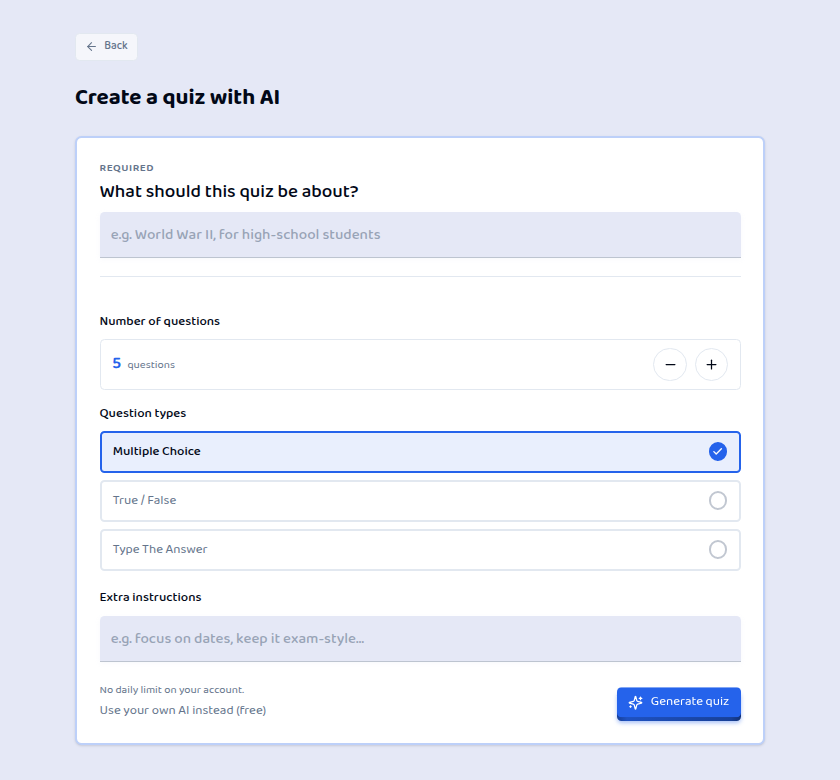

# OxygenQuiz

[](https://github.com/KastriotAvdiaj/OxygenQuiz/actions/workflows/tests.yml)
[](LICENSE)

A full-stack quiz platform: build quizzes by hand or with AI, play them solo against the clock,
or host a live multiplayer match with a room code. **Live at [oxygenquiz.com](https://oxygenquiz.com).**

React 18 + TypeScript on the front, ASP.NET Core 8 + PostgreSQL on the back, SignalR for
real-time play, in production on a Hetzner VPS behind Cloudflare.

<p align="center">
  
</p>

## Notable engineering

| Area | What's there | Read more |
| --- | --- | --- |
| **Real-time multiplayer** | SignalR lobbies joined by room code. The server owns timing, correctness and scoring; clients only render what they're told. A host refresh doesn't kill the lobby. | [multiplayer.md](docs/quiz/multiplayer.md) |
| **Fair timing** | Answers are scored on latency-compensated think time, with the server deciding how much of the client's clock to trust. The rule is covered by its own test suite. | [quiz-grading.md](docs/quiz/quiz-grading.md) |
| **Permission model** | Role-based access with `resource:action` permissions (`question:create`), cached per user. The controller decides *whether* a caller may act; the repository decides *on which rows*. | [user-role-management.md](docs/auth/user-role-management.md) |
| **AI with guardrails** | Quiz generation behind one provider interface, with reserve/commit quota, daily and spend caps, a per-attempt cost ledger and a kill switch. Model output is only ever a proposal: a strict parser drops bad questions with a reason and never lets the model choose grading rules. | [ai-quiz-architecture.md](docs/quiz/ai-quiz-architecture.md) |
| **Auth** | Short-lived JWT held in memory, and a refresh token rotated on every use in an HttpOnly cookie. Also Google sign-in, email verification, password policy and invite-gated signup. | [authentication.md](docs/auth/authentication.md) |
| **Data** | PostgreSQL through EF Core with 25 migrations, applied and seeded on startup. Hangfire runs background jobs such as the abandoned-session sweep. | [session-lifecycle.md](docs/quiz/session-lifecycle.md) |
| **Tests & CI** | About 290 backend tests (xUnit, Moq, EF InMemory) and a Vitest unit suite, both gating `main` in GitHub Actions. Storybook + Chromatic cover the UI states that are hard to reach by hand. | [testing.md](docs/development/testing.md) |
| **Production** | Frontend on Cloudflare Workers. API and Postgres run in Docker on a VPS behind nginx. Secrets fail fast at startup, and the app has rate limiting and security headers. | [production-topology.md](docs/deployment/production-topology.md) |
| **Decisions on record** | 15 architecture decision records (ADRs) explain why the non-obvious choices were made. | [docs/adr](docs/adr) |

## Run it

With Docker installed:

```bash
git clone https://github.com/KastriotAvdiaj/OxygenQuiz.git
cd OxygenQuiz
docker compose up --build
```

Open **http://localhost:5173**. The API runs on port 5000 and migrates and seeds itself on first
start. Sign in as the seeded admin: the email is `Seed:AdminEmail` in
`OxygenBackend/QuizAPI/appsettings.Development.json`, and the password is `admin`. AI generation
works offline because the app falls back to a built-in fake provider when no API key is set.

To run the frontend and API outside Docker, with hot reload, see
[Getting started](docs/README.md).

## Tests

```bash
npm ci && npx vitest run --project unit                       # frontend
dotnet test OxygenBackend/QuizAPI.Tests/QuizAPI.Tests.csproj   # backend
```

## Repository layout

```
src/                    React app, organised by feature (pages/, components/, lib/, hooks/)
OxygenBackend/QuizAPI   ASP.NET Core API: controllers → services → repositories, SignalR hubs
OxygenBackend/QuizAPI.Tests
docs/                   Feature docs, deployment, ADRs. Start at docs/README.md
deploy/                 Production nginx config, Postgres backup script, and an unadopted Caddy alternative
```

## License

[MIT](LICENSE) © Kastriot Avdiaj
