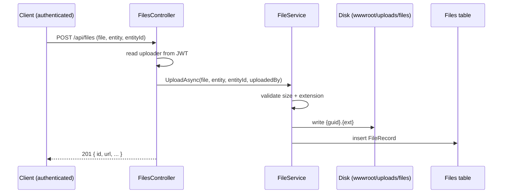

# Generic File Storage (Files entity)

This documents the **new** generic file store added for the avatar / product-photo /
document requirements. It is intentionally simpler and more general than the image
pipeline: **attach-on-upload**, any allowed file type, with an uploader audit trail.

> TL;DR — one authenticated `POST` with the file plus its owner (`entity` + `entityId`)
> creates the file and the DB record in a single step. There is no draft phase and no
> orphan cleanup, because the owner is known at upload time.

---

## Purpose

A single, reusable place to attach arbitrary files to arbitrary owners — things the image
pipeline was never meant for:

- **Avatars** (`entity = "User"`)
- **Product photos** (`entity = "Product"`)
- **Documents** (`entity = "Document"`) — PDFs, spreadsheets, etc.

The association is **polymorphic**: `Entity` (a logical type name) + `EntityId` (the
owner's id as a string, so it fits both `Guid`- and `int`-keyed owners). There is no
foreign key — this is deliberate, so the store doesn't need to know about every owner
table. The trade-off is no database-level referential integrity (acceptable for loosely
coupled attachments).

### `FileRecord` schema (table `Files`)

| Column | Type | Notes |
|---|---|---|
| `Id` | `Guid` | PK |
| `Entity` | `string` | logical owner type, e.g. `"User"`, `"Product"`, `"Document"` |
| `EntityId` | `string` | owner id (string holds Guid or int) |
| `Filename` | `string` | original filename |
| `FilePath` | `string` | stored path, e.g. `uploads/files/{guid}.{ext}` |
| `FileSize` | `long` | bytes |
| `UploadedBy` | `Guid?` | uploader (from the JWT) |
| `CreatedAt` | `DateTime` | upload time |

---

## Endpoints (`Controllers/Files/FilesController.cs`, `[Authorize]`)

| Method | Route | Body / query | Purpose |
|---|---|---|---|
| `POST` | `/api/files` | `multipart`: `file`, `entity`, `entityId` | Upload + attach |
| `GET` | `/api/files?entity=&entityId=` | — | List files for an owner |
| `DELETE` | `/api/files/{id}` | — | Delete file + record |

Validation (in `FileService`): size ≤ **10 MB**, extension ∈ an allowlist (images +
common documents). The uploader is taken from the JWT `sub` claim — the client never
sends it.

---

## Avatar change (implemented)

Users can change their profile picture, built on top of this Files store but with stricter,
avatar-specific safety.

- **Endpoint:** `POST /api/users/me/avatar` (`[Authorize]`, multipart `file`, ≤ 5 MB). The user is
  taken from the JWT — you can only change your own.
- **Validation (`AvatarService`):** image-only allowlist (**JPG / JPEG / PNG / WebP**) **plus a real
  content check** — the bytes are decoded with ImageSharp and the actual format is confirmed, so a
  non-image renamed to `.png` is rejected. **SVG is intentionally excluded** (it can carry scripts →
  stored XSS).
- **Storage:** the file goes through `IFileService` with `entity = "User"`, `entityId = <user id>`.
  The user's `ProfileImageUrl` is set to the new file's **absolute** URL, and the **previous avatar
  is deleted** so old files don't pile up.
- **Frontend:** a hover-to-change overlay on the profile avatar (`AvatarUploader`) with client-side
  type/size guards and an instant local preview; on success it invalidates the `authenticated-user`
  query so the new picture appears in the profile, header, and drawer at once.

Why not the image pipeline? Avatars don't need the draft/associate/orphan-GC dance — the user
already exists at upload time — so attach-on-upload (this store) is the right shape. We just added
the image-content validation the generic store lacks.

---

## Can both systems coexist? Yes.

They do not collide on anything:

| | Image pipeline (`ImageAsset`) | Generic store (`FileRecord`) |
|---|---|---|
| Table | `ImageAssets` | `Files` |
| Routes | `/api/ImageUpload/*` | `/api/files` |
| Disk folder | `wwwroot/uploads/` | `wwwroot/uploads/files/` |
| Service | `ImageService` | `FileService` |
| Owner link | `EntityType` + `int EntityId` (bookkeeping) | `Entity` + `string EntityId` |
| Lifecycle | upload → associate → GC orphans | attach-on-upload, no GC |
| Validation | image content + dimensions (ImageSharp) | extension allowlist + size |
| Auth | `[Authorize]` (used inside authoring) | `[Authorize]` |

Separate tables, routes, storage folders, and services means no migration or shared state
is needed for them to run side by side.

---

## Which one should I use?

- **Quiz / question images** → keep using the **image pipeline**. You need the upload-
  before-the-entity-exists draft flow, image-content validation, and orphan cleanup.
- **Avatars, product photos, documents, any new attachment** → use the **Files store**.
  The owner already exists, so attach-on-upload is the right shape, and you get the
  uploader audit trail for free.

### Required vs optional

- The **image pipeline is required infrastructure** for the existing authoring features —
  removing it would break quiz/question image handling.
- The **Files store is additive** — it serves the new requirements and nothing depends on
  it yet. It can grow (or absorb other use cases) without touching the image flow.

### Future convergence (not now)

If you ever want a single system, the clean target is: keep one **storage layer** (write
bytes / build URL / delete) shared by both, and either (a) keep two record types for the
two lifecycles, or (b) extend `FileRecord` with a nullable owner + status + an optional
image-validation path + a cleanup job, then migrate `ImageAsset` rows and retire it. That
is a deliberate, separately-tested refactor — not a prerequisite for the Files feature.
See the storage comparison above for the moving parts involved.
