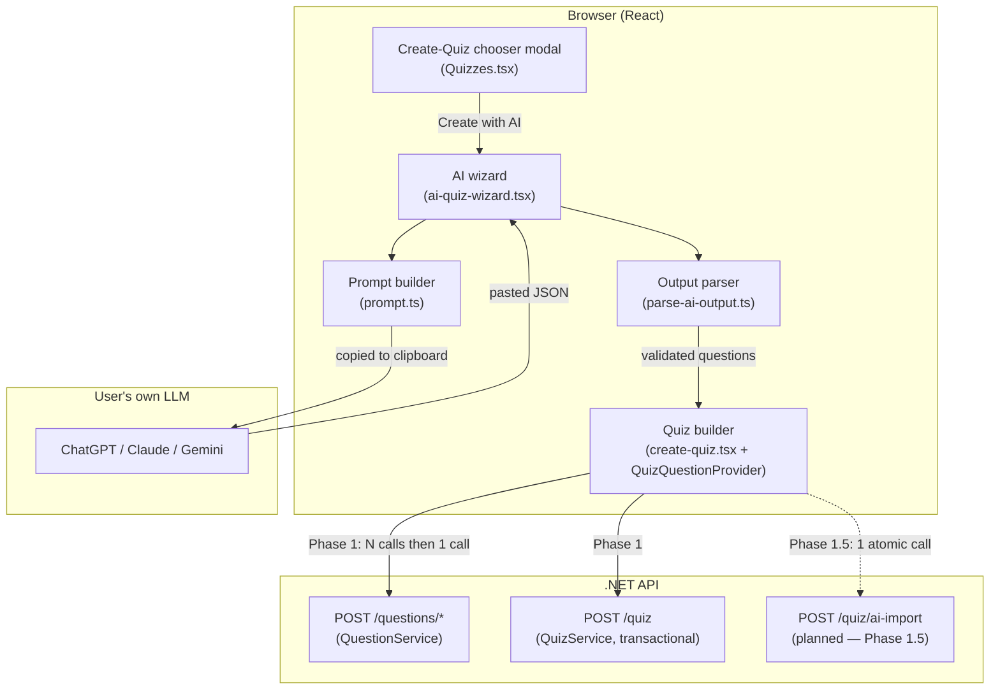

# AI-Assisted Quiz Creation — Architecture

Status: Phase 1 and the Phase 1.5 atomic import are implemented. Phase 2 (hosted API) not started.
Companion to `docs/quiz/ai-quiz-creation-plan.md` (the *what/why*); this is the *how*.
Last updated: 2026-07-17

---

## 1. What this feature is, in one paragraph

The user configures a quiz's fixed attributes (title, category, language, difficulty,
settings) by hand, pastes source material, copies a machine-generated prompt into any
external LLM, and pastes the LLM's JSON reply back. The app converts that JSON into
questions, drops the user into the normal quiz builder with everything prefilled, and
saves through the existing quiz-creation path. No LLM runs inside our infrastructure in
Phase 1 — the model is the user's own ChatGPT/Claude/Gemini, so there is **zero API cost
and zero server-side generation risk**.

The whole design is organised around one idea: **treat AI output as hostile, untrusted
input, and never let it touch anything it can corrupt.** Everything below follows from
that.

---

## 2. Component map



The dashed path is the hardening described in §7. Everything solid is implemented.

### Frontend files and their single responsibilities

| File | Responsibility | Must NOT do |
|---|---|---|
| `Quizzes.tsx` | Offer the manual/AI fork | Any AI logic |
| `AI-Quiz/prompt.ts` | Build the copy-only prompt string | Render prompt to screen; include entity IDs |
| `AI-Quiz/parse-ai-output.ts` | Extract + validate + resolve AI JSON into builder types | Any network/DB call; create entities |
| `AI-Quiz/ai-quiz-wizard.tsx` | Collect inputs, orchestrate steps, hand off to the builder | Re-implement question editing or submission |
| `Create-Quiz-Form/*` (existing) | Edit questions, validate, submit | Know anything about AI |

The wizard is deliberately thin: it **converges onto the existing builder** at the review
step, so all editing, validation, and persistence logic has exactly one implementation.

---

## 3. The data pipeline (happy path)

The AI's text passes through five stages, each of which narrows what the next stage can
receive. This is the core robustness mechanism — each stage has a single job and a typed
output.

```
raw string
  │  extractJson()      strip fences/prose, find the JSON object
  ▼
unknown JSON
  │  aiPayloadSchema     Zod: shape is { questions: [...] }
  ▼
typed-but-loose questions
  │  buildQuestion()     per-type rules (2–4 options, ≥1 correct, boolean answer, …)
  ▼                      → invalid ones DROPPED with a reason, not thrown
valid questions
  │  resolveDifficultyId / resolveSettings   names→IDs (strict), clamp scoring
  ▼
NewAnyQuestion + QuestionSettings   ← exactly the builder's own types
  │  QuizQuestionProvider(initialQuestions)
  ▼
the normal quiz builder, prefilled
```

Nothing downstream of `parse-ai-output.ts` can tell the questions came from an AI — by the
time they reach the builder they are ordinary `NewAnyQuestion` objects, identical to what
clicking "Create New" produces manually.

---

## 4. Trust boundaries and defense in depth

There are two hard boundaries. Validation is repeated at each because the layers protect
against different failures.

**Boundary 1 — LLM → browser.** The AI is untrusted. `parse-ai-output.ts` assumes the
input may be malformed, partial, prose-wrapped, or actively adversarial (prompt injection
in the source material trying to make the model emit junk). It never throws on bad data;
it drops and reports. This keeps a single bad question from sinking an otherwise good
quiz.

**Boundary 2 — browser → API.** The browser is untrusted by the server (standard web
assumption). The backend re-validates everything the client already checked:

- `CreateQuizAsync` already calls `ReferencedEntitiesExistAsync(CategoryId, LanguageId,
  DifficultyId, userId)` and `AllQuestionsExistAsync(...)` and rolls back if either fails
  (`QuizService.cs:192–199`). So even if the client sent a bad entity id, the server
  refuses it.
- The planned `ai-import` endpoint (§7) resolves difficulty **names** server-side against
  existing rows only, so "no entity creation via the AI flow" is enforced where it
  actually matters, not just in the UI.

> **Invariant.** Client-side resolution is a convenience for preview quality. The server
> is the source of truth. Never rely on the browser to enforce entity integrity.

---

## 5. Invariants the system must uphold

These are the properties that make the feature safe. Every change should preserve them.

1. **The AI never sees or emits entity IDs.** Categories and languages are not in the
   prompt at all; difficulty appears only as a closed list of names. (`prompt.ts`)
2. **Category and language are always inherited from the quiz.** They are never read from
   AI output, never `Unspecified`. (`parse-ai-output.ts` → `ParseContext`) The manual builder
   applies the same rule to hand-authored questions — see
   [quiz-question-classification.md](quiz-question-classification.md).
3. **No quiz flow ever creates a category, language, or difficulty.** Difficulty names
   resolve to existing rows or fall back; unmatched never creates. (§4, §7)
4. **AI questions are `Private`.** They don't pollute the shared question bank.
   (`buildQuestion` sets `visibility: "Private"`)
5. **Bad AI data degrades, it does not crash.** Invalid questions are dropped with a
   visible reason; the import proceeds with the rest. (`ParseResult.dropped`)
6. **AI output is never persisted without human review.** The user always lands in the
   builder and clicks submit themselves. (`ai-quiz-wizard.tsx` handoff)
7. **Scoring fields are bounded.** `pointSystem ∈ {Standard,Double,Quadruple}`,
   `timeLimitInSeconds ∈ [5,300]`, clamped on import. (`resolveSettings`)

---

## 6. Failure-mode catalogue

| Failure | Where caught | Behaviour |
|---|---|---|
| Reply has prose/markdown around JSON | `extractJson` | Fences stripped, object located; parses anyway |
| Reply is not JSON at all | `extractJson` → null | Friendly "couldn't find JSON" error, user re-pastes |
| JSON valid but wrong shape | `aiPayloadSchema` | "doesn't match expected format" error |
| One question malformed (no correct option, etc.) | `buildQuestion` | That question dropped w/ reason; others kept |
| Difficulty name not recognised | `resolveDifficultyId` | Falls back to quiz difficulty; flagged in summary |
| `pointSystem` / time out of range | `resolveSettings` | Clamped to defaults/bounds |
| All questions invalid | `parseAiOutput` | Whole import rejected with guidance |
| Clipboard blocked by browser | `handleCopyPrompt` | Error notification, no state change |
| Client sends bad entity id anyway | `CreateAiQuizAsync` (server) | Transaction rolls back, 400 |
| Quiz create fails after questions created | `CreateAiQuizAsync` transaction | **All rolled back — no orphans** (§7) |

Every row is handled. The last one — the orphan window — is closed by the atomic
`ai-import` endpoint described next.

---

## 7. The orphan-question problem

### 7.1 What it is

In Phase 1 the client creates the quiz in two conceptual steps, which are **separate,
independently-committed HTTP transactions**:

```
for each generated question:
    POST /questions/{type}        ← each commits on its own (QuestionService.SaveChangesAsync)
POST /quiz  { questionIds: [...] } ← separate transaction (QuizService)
```

If the final `POST /quiz` fails — a validation error, an auth/expiry hiccup, a network
drop, or the user simply closing the tab after the questions were created — the questions
are already committed to the database, but no quiz references them. They are **orphans**:
`Private`, unreferenced question rows that belong to no quiz and appear in no list.

### 7.2 Was this "just because we only did Phase 1"?

**Partly, and it's worth being precise.** The flaw is not something Phase 1 introduced and
later phases automatically remove. It is a **pre-existing property of the manual builder**:
`handleQuizSubmit` in `create-quiz.tsx` already creates questions one-by-one and then
creates the quiz, with no transaction spanning the two. The manual flow just rarely trips
it, because a user typically adds one or two new questions at a time.

Phase 1 **reused that exact orchestration** (deliberately — it's the proven path), so it
**inherited** the flaw and **amplified** it: an AI import creates ten-plus questions in one
batch, so the window between "questions committed" and "quiz committed" is wider and the
blast radius is larger. So:

- It is *not* a bug in the new code. The new code is correct given the existing contract.
- It will *not* fix itself by building Phase 2 (hosted API) — that phase changes *how text
  is generated*, not *how rows are persisted*.
- It *is* fixed by a deliberate change to the persistence contract: **Phase 1.5.**

### 7.3 The fix — one atomic endpoint (IMPLEMENTED)

`POST /api/quiz/ai-import` accepts the quiz fields plus the questions **inline** (not
pre-created ids) and does everything in a **single database transaction**
(`QuizService.CreateAiQuizAsync`). It reuses the pattern already in `CreateQuizAsync`
(`BeginTransactionAsync()` + rollback on any exception), but also creates the questions
inside that transaction, so a failure anywhere rolls back **everything** — orphans are
structurally impossible. It also accepts existing questions by id (for ones the user adds
from the bank during review), validating them within the same transaction. The wizard
submits through this endpoint (`aiImportMode` on `CreateQuizForm` →
`src/pages/Dashboard/Pages/Quiz/api/create-ai-quiz.ts`). Shape:

```
POST /api/quiz/ai-import
  BEGIN TRANSACTION
    validate category/language/difficulty exist         (reuse ReferencedEntitiesExistAsync)
    resolve each question's difficulty NAME → existing id (or fail; never create)
    create each Private question, collect its id
    create the quiz
    link quiz ⇄ questions
  COMMIT   ← all or nothing
```

Because create and link share one transaction, a failure anywhere rolls back **all** of
it. Orphans become structurally impossible, not merely unlikely. The frontend change is
small: the wizard's submit swaps the per-question loop + `POST /quiz` for this one call.
(The manual builder can adopt the same endpoint later, retiring the latent flaw there too.)

Proposed DTO shape (mirrors existing CMs, minus caller-supplied ids):

```
AiQuizImportCM {
    Title, Description, CategoryId, LanguageId, DifficultyId, Status, settings…
    Questions: [ InlineQuestionCM {
        Type,                       // MultipleChoice | TrueFalse | TypeTheAnswer
        Text, DifficultyName,       // name, resolved server-side; CategoryId/LanguageId come from the quiz
        PointSystem, TimeLimitInSeconds, OrderInQuiz,
        // + type-specific fields, identical to the existing *QuestionCM classes
    } ]
}
```

### 7.4 Interim mitigations (only if Phase 1 ships before 1.5)

Not a substitute for §7.3, but they shrink the risk:

- **Validate fully before creating anything.** Already done — `parse-ai-output.ts` rejects
  the whole batch if nothing is usable, so we never create questions for an import that
  was doomed from the start.
- **Best-effort compensation.** If `POST /quiz` fails, fire deletes for the
  just-created question ids. Honest caveat: this is a *saga* and its cleanup call can also
  fail (or the tab closes first), so it reduces but cannot eliminate orphans.
- **Background sweep.** A periodic job deleting `Private`, quiz-unreferenced questions
  older than N hours. Pure defense-in-depth; keeps the table clean regardless of cause.

Recommendation: **go straight to §7.3.** The transactional endpoint is a few hours of work,
reuses an existing pattern, and turns "unlikely-but-possible corruption" into "impossible".
The interim options are only worth it if you need to ship the UI before touching the API.

---

## 8. Extension seam for Phase 2 (hosted API)

Phase 2 replaces copy-paste with in-app generation, but must not disturb §5's invariants.
The seam is clean because generation and parsing are already separate:

- `buildPrompt()` (or a C# port of it) produces the prompt.
- A new **server-side** endpoint calls a hosted model (Gemini Flash / Claude Haiku /
  GPT-4o-mini) behind an `IQuizAiProvider` interface, so the provider is swappable and the
  API key never reaches the browser.
- The model's reply flows through the **same** validation — ideally by having the
  `ai-import` endpoint accept "raw model text" and run the C# equivalent of
  `parse-ai-output.ts`, or by returning the text to the browser and reusing the existing
  parser before the atomic import.

Because parsing/validation is shared, a lower-quality hosted model is safe: bad JSON is
caught exactly as external-LLM bad JSON is today. Cost is controlled at this seam (per-user
quotas, response caching, rate limits), never in the model choice alone.

---

## 9. Testing strategy

The pipeline's stage boundaries make it highly unit-testable without any network or DB.

- **`extractJson`** — fenced ```` ```json ````, bare object, object-with-prose, trailing
  commentary, non-JSON, empty. Each returns the object or null.
- **`parseAiOutput`** — table-driven fixtures of realistic (and adversarial) LLM replies
  asserting: correct questions survive, bad ones land in `dropped` with the right reason,
  unknown difficulty populates `difficultyFallbacks`, scoring is clamped, category/language
  always equal the `ParseContext`.
- **Invariant tests** — assert no code path in the parser can emit a category/language not
  equal to the context, or a `difficultyId` outside the supplied difficulties ∪ {fallback}.
- **Backend (Phase 1.5)** — integration test that forces the quiz insert to fail and
  asserts **zero** question rows were committed (the orphan regression test).
- **E2E** — modal fork routes correctly; a canned good reply produces a prefilled builder;
  a canned bad reply shows the error and creates nothing.

---

## 10a. Per-flow persistence semantics (deliberate divergence)

The manual and AI flows intentionally do **not** share failure semantics, because the
questions mean different things in each:

| | Manual flow | AI flow |
|---|---|---|
| Who authored the questions | The user, by hand | The AI, as a byproduct |
| Questions-first ordering | Yes (unchanged) | Yes (API requires it) |
| If quiz-create fails | **Keep** the questions — they're the user's work | **Discard** everything — atomic |
| Rationale | Orphans are reusable drafts, not garbage | Orphans are garbage the user never asked to keep |
| Fix required | Make the outcome *visible*, not atomic | Transactional `ai-import` endpoint (§7.3) |

So the manual flow is **not** being made atomic. Its only real defect is that the surviving
questions are *silent* — the user sees a generic failure and isn't told their work was
saved. The fix is a message ("Your questions were saved to your bank — you can reuse them"),
which converts an accidental orphan into a designed "draft questions" outcome. The AI flow
gets true atomicity because there is no version of "keep the AI's leftover questions" that
benefits anyone.

## 11. Maintainability & known seams

What is deliberately cheap to change, and where future cost is concentrated.

**Cheap by design**
- The AI flow converges onto the existing builder, so quiz editing/validation/submission
  has one implementation. Changing how quizzes are saved updates both flows at once.
- `prompt.ts` / `parse-ai-output.ts` / `ai-quiz-wizard.tsx` have disjoint jobs; the parser
  is pure (no I/O), so it's unit-testable in isolation.
- Limits live in `AI_QUESTION_LIMITS`; point systems derive from the `PointSystem` enum;
  default settings from `DEFAULT_QUESTION_SETTINGS`. No duplicated magic values.
- The builder integration is one additive optional prop (`initialValues`), not a fork.

**Known seams (ranked by likely future cost)**
1. **Question-type knowledge is scattered.** Adding a 4th type touches `types.ts`,
   `constants.ts`, the context's `getValidationSchema`, three create mutations, the display
   cards, and now `prompt.ts` + `parse-ai-output.ts`. This is a *pre-existing* shotgun-surgery
   smell that this feature widened by two files. If question types keep growing, introduce a
   **per-type registry** (one module per type declaring its Zod schema, prompt spec, parser
   branch, and card) so adding a type means adding one file. Out of scope for now; named so
   it's a conscious choice, not drift.
2. **Prompt duplication at Phase 2.** `buildPrompt` is TS; a server-side generator would
   restate it. When Phase 1.5 lands, make the **backend the prompt authority** (expose the
   prompt via an endpoint the copy button fetches) so Phase 2 reuses it with no second copy.
3. **Validation restated vs derived.** The parser re-encodes some rules already in the
   `create*QuestionInputSchema` Zod schemas. They are kept separate *on purpose* — the
   builder types and API input types differ in shape (e.g. `acceptableAnswers` is
   `{value}[]` in the builder but `string[]` at the API), so naive unification reintroduces
   bugs. Track as drift risk; unify only where shapes genuinely align.

## 12. Making new question types cheap (a path, not a task)

Today, adding a question type is shotgun surgery (§11, item 1). This section records the
target shape so that *if* a 4th type is ever added, there's a plan. It is **not** worth
doing now — with three stable types the abstraction would cost more than it saves. Revisit
it the day a 4th type is actually on the table.

### The idea: one module per type, a registry that assembles them

Each question type is described **once**, in its own module, and a registry exposes the
pieces the rest of the app needs. Adding a type becomes "write one module + register it",
instead of editing eight files and hoping you found them all.

```
// question-types/multiple-choice.ts
export const multipleChoiceType: QuestionTypeModule = {
  key: QuestionType.MultipleChoice,
  makeDefault: (id) => ({ ...DEFAULT_NEW_MULTIPLE_CHOICE, id }),   // was: constants.ts
  createSchema: createMultipleChoiceQuestionInputSchema,           // was: context getValidationSchema
  promptSpec: `- "MultipleChoice" also requires: …`,              // was: prompt.ts TYPE_SPECS
  parseAiQuestion: (raw, base) => { … },                          // was: parse-ai-output.ts buildQuestion
  toAiImport: (q, settings) => ({ … }),                           // was: create-quiz.tsx mapping
  Card: MultipleChoiceCard,                                        // was: display-card switch
  createMutationHook: useCreateMultipleChoiceQuestion,            // was: create-quiz.tsx switch
};

// question-types/registry.ts
export const QUESTION_TYPES = [multipleChoiceType, trueFalseType, typeTheAnswerType];
export const byKey = new Map(QUESTION_TYPES.map((t) => [t.key, t]));
```

Then the scattered call sites become lookups:
- `prompt.ts`: `allowedTypes.map((t) => byKey.get(t).promptSpec)` — already close to this.
- `parse-ai-output.ts`: `byKey.get(raw.type).parseAiQuestion(raw, base)` — replaces the switch.
- `create-quiz.tsx`: `byKey.get(q.type).toAiImport(...)` and `.createMutationHook` — replaces
  two switches.
- The display card: `const { Card } = byKey.get(q.type)` — replaces the render switch.

The AI feature is **already** partly registry-shaped (`TYPE_SPECS` in `prompt.ts` is a
per-type record keyed by `QuestionType`), so it would fold in cleanly.

### What the registry can and cannot remove

- **Frontend:** a registry can collapse *all* the per-type touch points above into one
  module. This is the bulk of the pain and the bulk of the win.
- **Backend:** the EF story limits how far this goes. Each type is a real subclass of
  `QuestionBase` with its own `DbSet` and a migration, and C# lacks the frontend's easy
  structural typing. You can still centralise the *mapping* (a `Dictionary<string,
  Func<AiImportQuestionCM, QuestionBase>>` replacing the `switch` in `BuildAiQuestionEntity`,
  and similar for the existing create endpoints), but a new type will always need its entity,
  its `DbSet`, and a migration. That irreducible core is ~3 edits; the registry removes the
  rest.

### Migration strategy (if it's ever done)

Introduce the registry **without** a big-bang rewrite: build it alongside the existing
switches, route one call site (say the AI parser) through it, confirm parity, then convert
the others one at a time. Each step is small and independently verifiable, so the refactor
never blocks feature work.

## 13. Summary of guarantees

When Phase 1.5 lands, the feature guarantees: the AI can never create or corrupt an
entity; malformed AI output degrades gracefully and never persists without review; and a
failed save leaves the database exactly as it was. Phase 1 delivers all of these **except**
the last (the orphan window), which §7.3 closes.
