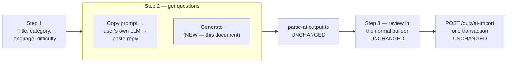
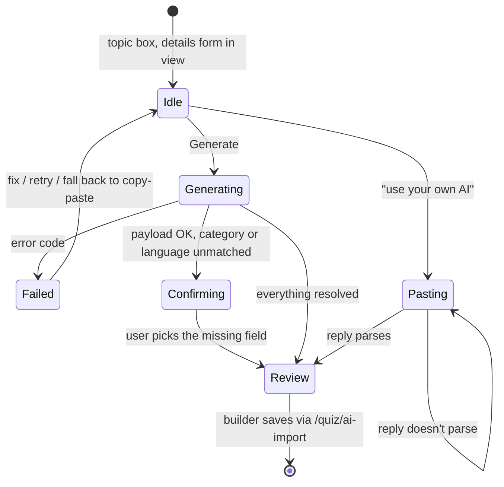
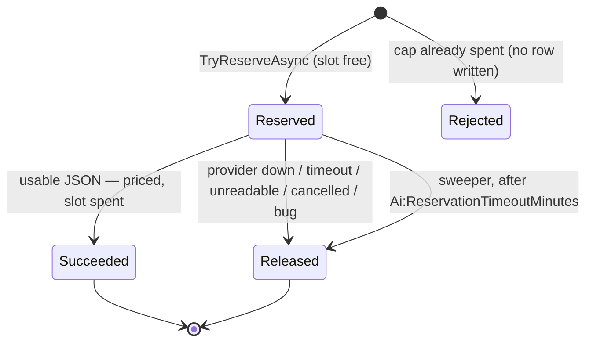

# In-App AI Generation — How It Actually Works

**This is the living document for the feature as built.** The plan
([`ai-quiz-generation-plan.md`](ai-quiz-generation-plan.md)) says what we intend; this says what
the code does today, and §9 keeps an honest register of the gaps we have not closed.

Update this file in the same commit as the behaviour it describes. A gap that gets fixed moves
out of §9; a gap discovered while implementing gets added to it, even if it isn't fixed yet —
especially then.

Status: **slices 2.0 and 2.1, merged to `main`.** Topic and source-*text* modes,
the one-box wizard, quota, spend caps, kill switch, and a single server-owned prompt shared with
copy-paste. **Not yet: streaming progress (2.2) and file upload (2.3)** — "source" today means
pasted text, not a PDF. Last updated: 2026-08-22

---

## 1. Where this sits in the bigger flow

The user's journey is unchanged from Phase 1 except for one step. They configure the quiz, they
get questions, they review them in the normal builder, they save through the existing atomic
import. The only new thing is *how the questions arrive*.



Both branches of step 2 produce the same thing: a `{ "questions": [...] }` JSON object of
unknown quality. Everything after step 2 cannot tell them apart, and that is deliberate — it
means in-app generation inherits every guarantee the copy-paste flow already had.

---

## 1a. The one-box flow, and the invariant it bends

The wizard's first screen is a topic and a Generate button. Everything else is inferred and
lands **pre-filled in the review step**, where the human confirms or changes it:

| Field | Where it comes from |
|---|---|
| Title | Model suggests it. Free text — nothing to resolve. |
| Category | Model picks from the category **names** we send. Unmatched → blank. |
| Language | Model picks from the language **names** we send, normally matching the language the topic was typed in, and writes the questions in it. |
| Difficulty, count, types | Defaults, shown in the details form under the topic box. |

The details form is **visible, not hidden**. It has been an inline accordion, a centred dialog
and a right-hand drawer, and every version traded one problem for another: the accordion
tripled the height of the wizard's one screen and pushed Generate out of view, and the overlays
fixed that by concealing their own contents — which is why the trigger had to grow a "3 set"
badge, and why a user who never opened it never learned the knobs existed.

What resolves it is layout, not disclosure. The fields sit in a `md:grid-cols-2` grid — what the
quiz *is* on the left (title, description, classification), what the AI should *make* on the
right (count, types, extra instructions) — which keeps the whole card roughly one viewport tall
with Generate still on screen, and collapses to a single column below `md`. Only the topic
carries a "Recommended" mark; the section header states once that everything under it is
optional, so no field repeats "(optional)" in its own label. Fields write straight through —
no draft state to apply or cancel, since everything is confirmed again at review.

This changes a rule the original design stated flatly — *"Do NOT output a category or a language"*
— so it is worth being precise about what moved and what did not.

**Unchanged.** A *question* is never classified by the model. Questions inherit the quiz's
category and language, the prompt still forbids per-question classification, and
`AiQuizImportCM` still refuses to accept it. No entity is ever created: a suggested name is
matched case-insensitively against the list we supplied and discarded if it doesn't match.
No id crosses the API in either direction.

**Changed.** The *quiz's* category and language may now be **suggested** by the model. The
original rule existed to stop the AI determining classification; what it accidentally also
enforced was that the human express their choice through a dropdown *before* generating. Those
are different things. Confirming a pre-filled value in a review step the user already passes
through is the same decision, made at a better moment.

**Why that's still safe.** Three independent gates survive: the model can only name things that
exist, the server re-checks the name against what it sent, and `CreateAiQuizAsync` validates the
resolved id inside the import transaction — including the refusal to accept `Unspecified`. The
worst case is a wrong-but-real category on a Draft quiz that a human is looking at.

---

## 2. The pieces

| Piece | File | What it is responsible for |
|---|---|---|
| Config | `Services/Ai/AiOptions.cs` | Every tunable. Bound from the `"Ai"` section. |
| Contracts | `Services/Ai/AiGenerationContracts.cs` | Modes, statuses, the closed error-code set, request/outcome records. |
| Prompt | `Services/Ai/AiPromptBuilder.cs` | The prompt text, both modes. No IDs, ever. |
| Provider | `Services/Ai/IQuizAiProvider.cs`, `OpenAiCompatibleQuizAiProvider.cs` | Prompt in, raw reply out. Retries transport failures. Knows nothing about quizzes — or about which vendor answers (§2a). |
| Fake provider | `Services/Ai/FakeQuizAiProvider.cs` | Canned replies, no network, no cost. `Ai:Provider="Fake"`. Everything downstream still runs for real. |
| JSON | `Services/Ai/AiJsonExtractor.cs` | "Is there a usable JSON object in this reply?" and nothing more. |
| Quota | `Services/Ai/IAiQuotaService.cs`, `AiQuotaService.cs`, `IAiQuotaPolicy.cs` | Reserve → commit / release. Daily cap. Spend cap. |
| Ledger | `Models/Ai/AiGenerationUsage.cs`, `Repositories/AiGenerationUsageRepository.cs` | One row per attempt: quota, cost, quality. |
| Sweeper | `Services/Ai/AiReservationSweeper.cs` | Frees slots held by requests that died. Hangfire, every 5 min. |
| Orchestration | `Services/Ai/AiGenerationService.cs` | The order of operations in §3. |
| HTTP | `Controllers/Quizzes/AiQuizController.cs` | DTO mapping and code → status. No logic. |
| API client | `Quiz/api/generate-ai-quiz.ts` | The three calls, plus `AiGenerateError` — normalises the server's code out of the axios error. |
| Wizard container | `AI-Quiz/ai-quiz-wizard.tsx` | State, the generate call, resolving suggested names → ids, the builder handoff. |
| Wizard view | `AI-Quiz/ai-quiz-wizard-view.tsx` | **Composition only.** The three screens (§3b) and which component renders in each. |
| Shared draft | `AI-Quiz/use-ai-quiz-draft.tsx` | Everything both AI paths share: lookups, request state, reply → parse → builder handoff. |
| Own-AI path | `AI-Quiz/own-ai-quiz.tsx` + `own-ai-quiz-view.tsx` | Copy the prompt out, paste the reply back. Its own route — [`ai-quiz-two-paths.md`](./ai-quiz-two-paths.md). |
| View pieces | `AI-Quiz/components/*.tsx` | One block each: `generation-input`, `advanced-options`, `quota-note`, `generate-error-panel`, `confirm-details-card`, `import-summary`, `question-type-options`, `question-count-stepper`. |
| Limits | `AI-Quiz/prompt.ts` | Numbers only. The prompt text lives in C# (slice 2.1). |

---

## 2a. The vendor is configuration, not code

`OpenAiCompatibleQuizAiProvider` was `DeepSeekQuizAiProvider` until 2026-08-22. The rename is not
cosmetic: the class never contained anything DeepSeek-specific, and the name kept suggesting that
changing vendor meant changing code.

**What "OpenAI-compatible" means here.** It names a wire format, not a company, and nothing in
this feature talks to OpenAI or needs an OpenAI account. When OpenAI published
`POST /chat/completions` — a body of `model`, `messages`, `temperature`, `max_tokens`,
`response_format`, answering with `choices[0].message.content` and a `usage` block — that shape
became the industry default. DeepSeek speaks it. Alibaba's Qwen exposes an endpoint literally
called `compatible-mode` that speaks it. So do Mistral, Groq and most local runners.

**So the vendor lives in five config values**, and swapping vendor touches no C#. Since
2026-08-31 those five live together as one **named catalogue entry** under `Ai:Vendors`, and an
environment selects one with a single value:

| Setting | What it selects |
|---|---|
| `Ai:Provider` | **How**, not who: `"OpenAiCompatible"` (a real HTTP call) or `"Fake"` (the offline stub). |
| `Ai:Vendor` | **Who** — the name of an `Ai:Vendors` entry, and the only thing an environment overrides to swap vendor. Unknown name → AI switches off rather than guessing. |
| `Ai:BaseUrl` | Resolved from the selected entry. Setting it directly still works, with a deprecation warning. |
| `Ai:Model` | Which model there. Recorded on every usage row. **Not** shown in the wizard — the model note was removed (see `quota-note.tsx`); the `ai-quota` endpoint still returns it, nothing renders it. |
| `Ai:InputCostPerMillionUsd` / `Ai:OutputCostPerMillionUsd` | What it costs. **Change these in the same edit** — see §9.14. |
| `Ai:ReasoningEffort` | How long a *reasoning* model may think. Unset for everything else, and unset means the field is never sent. See §2b. |

Two things follow from that split, and both were bugs waiting to happen before it:

- **A typo in `Ai:Provider` used to mean "make real paid calls."** Anything that wasn't `"Fake"`
  fell through to the HTTP provider. It now switches the AI features off unless the value is one
  it recognises — it used to throw at startup, until that was reconsidered in
  [`../adr/0004-ai-misconfiguration-disables-the-feature.md`](../adr/0004-ai-misconfiguration-disables-the-feature.md):
  AI is optional and nothing else in the app needs it, so a typo takes the feature down rather than
  the site. The legacy vendor names `"DeepSeek"` and `"Qwen"` still boot, with a warning, so an
  existing `.env` survives the rename; delete that branch once no environment sets one.
- **Nobody could see which model wrote a quiz.** `GET /quiz/ai-quota` returns the active model
  id, null whenever generation is unavailable (naming a model we are not about to call is a
  claim, not information), and the fake provider honestly reports `fake-provider`. ⚠️ **The
  wizard no longer prints it.** The "Questions are written by *model*" line was removed —
  `quota-note.tsx` says so explicitly — so the endpoint field currently has no consumer.

**The boundary of "config only"** is the request body. `ChatRequest` carries the standard fields
and nothing else, so a vendor needing an extra one needs a line of C#. `reasoning_effort` is the
one field that has since crossed that line — added deliberately, and serialised only when
`Ai:ReasoningEffort` is set, so a vendor that does not accept it never receives it. The bar for
the next one is the same: it is not enough that a vendor offers it. Before adding an
`Ai:Vendors` entry for a new endpoint, check three things with a raw curl: that
`response_format: json_object` is accepted, that the reply lands in `choices[0].message.content`,
and that `usage` reports `prompt_tokens`/`completion_tokens` — **the cost ledger silently records
zero if that last block is missing or named differently**, and a ledger of zeroes disables both
budget caps without erroring.

---

## 2b. Vendor quirks the abstraction does not hide

Swapping vendor is a config change (above). Swapping vendor *without surprises* is not — these are
the differences that reached us as bugs rather than as documentation.

**`max_tokens` is reserved against the rate limit, not measured after the fact.** This is the one
that cost an afternoon. Groq's free tier allows 8,000 tokens per minute; `Ai:MaxOutputTokens` was
8,000; the prompt was ~886 tokens. The request was refused **before generation started** — 8,886
requested against an 8,000 ceiling — and it would have been refused every time, forever, because a
single call was over the whole per-minute budget on its own. Waiting does not help; only lowering
the ceiling does. **Rule: `MaxOutputTokens` + prompt must fit under the vendor's TPM limit.** 4,000
covers a 15-question quiz.

**A reasoning model's thinking is spent inside `max_tokens`, before any answer.** Reasoning
tokens are billed as output and counted against the ceiling, and they come first — so a ceiling
that fits the answer but not the thinking produces an *empty* completion rather than a truncated
one. Under `response_format: json_object` the vendor then rejects the empty string, and what
reaches the log is a 400 `json_validate_failed` with `"failed_generation": ""` — a parse error
for a problem that is nothing to do with parsing. Hit on 2026-08-26 with `openai/gpt-oss-120b`
on Groq and a 300-token palette ceiling. Two settings fix it together: enough headroom in the
ceiling, and `Ai:ReasoningEffort` to keep the thinking short (`"low"`/`"medium"`/`"high"` for
gpt-oss, `"none"`/`"default"` for Qwen 3.6 27B). **Rule: before selecting an `Ai:Vendors` entry
whose model is a reasoning model, check every per-call ceiling, not just `Ai:MaxOutputTokens`** —
the tightest one fails first, and here that was the palette proposer at 300.

`ReasoningEffort` lives *inside* the vendor entry for exactly this reason: it is a property of the
model, so selecting a vendor and forgetting its effort setting was a way to get empty completions
with no error worth reading. It cannot be forgotten separately any more. `Ai:MaxOutputTokens`
stays a top-level key — it is our spending decision, not the vendor's.

`Ai:ReasoningEffort` is one value for the whole app, because it describes the configured model
rather than a feature. The trade-off is real and worth stating: `"low"` was chosen for the
palette proposer, which barely needs to think, and quiz generation inherits it. If generated
quizzes get noticeably worse after a reasoning model is configured, suspect this before the
prompt. The fix is a per-call override on `CompleteJsonAsync`, beside the token ceiling that is
already per-call for the same reason.

**Rate limits do not agree on a status code.** OpenAI and DeepSeek answer 429. Groq answers **413
Payload Too Large** with `code: "rate_limit_exceeded"`. Status alone therefore can't classify the
failure, and `IsUpstreamRateLimit` reads the body — which we already had in hand for the log. It is
deliberately *not* retryable: our retry is one attempt two seconds later, and no per-minute budget
refills in two seconds. The user gets a message naming the actual remedy ("wait a minute, or ask
for fewer questions") rather than the generic outage line.

**Reasoning models spend output tokens before writing anything.** `openai/gpt-oss-120b` and its
kind emit internal reasoning first, billed as output and counted against TPM. A `max_tokens` that
looks generous for the answer can be consumed entirely by reasoning, and the vendor then reports
`json_validate_failed` with an empty `failed_generation` — which reads like a prompt problem and
isn't one.

**Free tiers are rate-limited in two dimensions, and the day limit is the tighter one.** Groq's
free tier is ~30 requests/minute but ~250/day. Our own `ai` policy (6/min per user) is stricter on
the minute and says nothing about the day, so a busy afternoon hits *their* ceiling first, and it
arrives as a generation failure rather than as our own 429.

**Prices are ours to keep current, and nothing validates them.** See §9.14.

---

## 3. One request, end to end

```mermaid
sequenceDiagram
    autonumber
    participant C as Client
    participant Ctl as AiQuizController
    participant Svc as AiGenerationService
    participant Q as AiQuotaService
    participant DB as AiGenerationUsages
    participant P as OpenAiCompatibleQuizAiProvider
    participant DS as Ai:BaseUrl

    C->>Ctl: POST /api/quiz/ai-generate
    Note over Ctl: [Authorize] + "ai" rate-limit policy
    Ctl->>Svc: GenerateAsync(userId, request)

    Svc->>Svc: Ai:Enabled? — else FeatureDisabled
    Svc->>Svc: user.EmailConfirmed? — else EmailNotVerified
    Svc->>Q: IsOverBudgetAsync()
    Q->>DB: SUM(cost) over 30 days
    Svc->>Svc: normalise + validate content

    Svc->>Q: TryReserveAsync()
    Q->>DB: BEGIN; advisory lock(userId)
    Q->>DB: COUNT slots used today
    alt at the cap
        Q-->>Svc: not reserved
        Svc-->>Ctl: QuotaExceeded
        Ctl-->>C: 429 + Retry-After
    else slot free
        Q->>DB: INSERT status=Reserved; COMMIT
    end

    Svc->>P: CompleteJsonAsync(prompt)
    P->>DS: POST /chat/completions (json_object mode)
    DS-->>P: completion + token usage
    P-->>Svc: raw text

    Svc->>Svc: AiJsonExtractor.TryExtract
    alt no usable JSON
        Svc->>P: retry once, stricter suffix
    end

    alt still nothing
        Svc->>Q: ReleaseAsync(ModelOutputInvalid)
        Svc-->>Ctl: ModelOutputInvalid
        Ctl-->>C: 502
    else usable
        Svc->>Q: CommitAsync(model, tokens, count)
        Q->>DB: status=Succeeded, price it
        Svc-->>Ctl: payload JSON
        Ctl->>Ctl: audit AiQuizGenerated
        Ctl-->>C: 200 { payload, quotaRemaining, tokens }
    end
```

**The order is the safety story**, and it is easy to break by accident:

1. **Gates before writes.** A disabled feature or a blown budget costs nothing, not even a row.
2. **Reserve before calling the provider.** Reserving *after* would let N concurrent requests all
   reach the vendor before any of them is counted — the cap would be advisory at best.
3. **Release on every visible failure.** A generation that produced nothing must not cost a slot.
   Every release passes `CancellationToken.None` on purpose: if the caller's token is what killed
   us, a cancelled token would skip the write and strand the reservation.
4. **Commit only with usable JSON in hand.**

---

## 3b. The browser's half

The wizard is a container (`ai-quiz-wizard.tsx`, all state and calls) plus a prop-driven view
(`ai-quiz-wizard-view.tsx`, all markup). Every state below is reachable from a Storybook story
with no server — that split is why, and it's the convention described in
[storybook.md](../development/storybook.md).

**The view is composition, not markup.** It grew to 900 lines during slice 2.1 and was split:
each substantial block is now its own file under `AI-Quiz/components/`, and the view holds the
three-screen branch plus the wiring. Props stay flat rather than grouped into objects — the
container owns all the state and the view owns none, so a story sets up any screen with plain
args, and grouping would trade that for a shorter signature. If you're changing one part of the
wizard, open the component, not the view.



**Resolving suggestions.** The model returns title, category and language as *names*, inside
the payload. `extractQuizSuggestions` in `parse-ai-output.ts` reads them — **for both paths**,
from the payload itself, not from a server response field. The container then matches the names
case-insensitively against the lists React Query already loaded, and a user's explicit pick
always wins:

```
effectiveCategoryId = userPick ?? resolve(suggestedCategoryName)
effectiveLanguageId = userPick ?? resolve(suggestedLanguageName)
effectiveDifficultyId = userPick ?? middle-weighted difficulty
effectiveTitle        = userTitle || suggestedTitle || topic
```

All four are **derived during render**, not stored — mirroring state into more state is how the
two get out of sync, and the copy is always a render behind (see CLAUDE.md, "Effects and state").
The one `useMemo` that matters is the parse: its output seeds `QuizQuestionProvider`'s
`initialQuestions`, so a fresh array each render would invite the provider to reset the user's
edits mid-review. That memo is for correctness, not speed.

**Confirming.** If the model named a category or language we don't have, the questions are still
good — the view shows an "Almost there" card asking only for the missing field, and says what the
AI suggested and why it didn't match. Throwing away a valid generation over an unmatched name
would be the wrong trade.

**Both paths converge — and *where* they converge is load-bearing.** They meet at a single
`payload: string | null`, before any resolution happens. From there suggestions, ids, parsing
and the builder handoff are one code path, so nothing downstream can tell which produced the
questions.

> **This was got wrong once, and the failure is worth remembering.** The suggestions were
> originally extracted **server-side** and returned as separate response fields
> (`suggestedTitle`, `suggestedCategory`, `suggestedLanguage`), specifically so that
> `parse-ai-output.ts` wouldn't have to change. But a pasted reply never goes through the
> server, so it never got enriched — and the wizard demanded a category, language and
> difficulty by hand for a reply that plainly contained all three. Generation and copy-paste
> had stopped producing the same thing.
>
> The lesson isn't "don't put logic on the server". It's that **"don't touch this file" is a
> means, not an end.** Protecting `parse-ai-output.ts` was only ever worth doing because it
> kept the two paths identical; when keeping it untouched is what makes them differ, the rule
> has eaten its own purpose. Reading the envelope in the parser — where both paths already go —
> is the fix, and it deletes the server-side plumbing rather than adding to it.

**Errors.** `AiGenerateError` normalises the server's code out of the axios error, because the
shared interceptor keeps only the message. The view switches on the code to decide what to offer:
retry for the transient ones (and it says the daily allowance wasn't touched, because it wasn't),
a reset time for quota, and a promoted copy-paste path when generation is unavailable at all.

**Every AI request carries its own timeout, and they are all different.** The axios instance
sets none, and a browser XHR with `timeout: 0` waits for a response forever — so a server that
accepts the connection and never answers leaves a spinner with no error and no way to retry.
That shipped: "Copy prompt" on the own-AI page sat at "Preparing…" indefinitely in production.
`AI_TIMEOUTS_MS` in `api/generate-ai-quiz.ts` sets prompt 15s (server-side string building),
generate 120s (must exceed `Ai:TimeoutSeconds`, or we abandon a call the user already paid a
quota slot for) and quota 10s (decoration). A single global default would have to be the
largest of the three, which is the same as having none for the two fast calls. Axios reports a
timeout as `ECONNABORTED`, which `toAiGenerateError` turns into "took too long" rather than
"couldn't reach" — different advice for the user.

**Copying the prompt can fail after it arrives, and that is not the same failure.** The write
happens after an awaited request, and clipboard access needs the click that triggered it to
still be recent (Chrome ~5s of transient activation; Safari stricter; `navigator.clipboard` is
absent entirely outside a secure context). A slow server spends that budget before `writeText`
runs. So the own-AI container splits the two: no prompt → a toast, because there is nothing to
show; prompt but no clipboard → render it in a read-only field that selects itself on focus.
Copying the prompt is the whole point of that page, so "your browser blocked it" cannot be the
end of the road when we are already holding the text.

**The quota lookup may never take the page down.** `GET /quiz/ai-quota` is called on mount
for one line of text. `useAiQuota` therefore sets `throwOnError: false` — without it a failing
quota endpoint replaces the whole wizard with the generic error boundary, and takes the
copy-your-own-prompt path down with it even though that path needs neither the quota nor the
provider. `quota: null` is a supported state everywhere downstream. This shipped wrong once;
see the note in [../development/error-handling.md](../development/error-handling.md).

**When generation is unavailable, the button stays put and goes disabled.** It used to be
hidden, which left the card with no primary action at all — and worse in the one case that
raises no error: the kill switch reports `quota.enabled === false`, `QuotaNote` early-returns
on `!enabled`, so the whole row vanished and the wizard offered no way forward and no reason.
Disabled keeps the shape of the screen, the error panel above still carries the server's
message for the three causes that have one, and a `title` covers the fourth for pointer users.
The way through is the own-AI link, which sits in the same place in every state. The copy-paste
path is a page of its own in the
router now (`own-ai-quiz.tsx`), reached by that link. It was an inline disclosure, then a
drawer, and both were the same mistake: a second flow hidden inside the first. See
[`ai-quiz-two-paths.md`](./ai-quiz-two-paths.md).

The generate request sets **`skipErrorToast`** so the interceptor's generic toast doesn't stack
on top of that panel, and the container stores the error rather than raising a toast of its own.
Getting this wrong is easy and it shipped wrong once — one failure briefly produced two toasts
*and* the panel. See "Mutations: the global toast, and opting out of it" in
[error-handling.md](../development/error-handling.md).

**Validation before the request.** Generate and Copy prompt stay clickable on an incomplete
form; pressing either marks the offending field invalid, focuses it, and says what's missing.
A disabled button with a not-allowed cursor says "no" without saying why. The message is derived
from current state, not stored, so it clears itself as soon as the field is filled.

---

## 4. Quota: the state machine

Every attempt is a row in `AiGenerationUsages`. A row occupies one of the user's daily slots
unless it is `Released`.



`Failed` exists in the enum but nothing produces it today. It is there so the first time we
decide some failure *should* cost a slot, that decision isn't blocked behind a migration.

### Why the advisory lock

Counting rows and then inserting one is check-then-act. Two concurrent requests both read
"4 used" against a cap of 5, and both proceed. The window is not microseconds — a generation is
seconds long, and a double-clicked button lands squarely inside it.

`AcquireUserQuotaLockAsync` takes a Postgres transaction-scoped advisory lock keyed on the user
id, so the count-and-insert is serialised per user. Contention is per-user, so it costs nothing
in practice. On non-Postgres providers it is a no-op (see §9).

### 4a. Staff have no daily cap

`ConfigAiQuotaPolicy` returns `null` for anyone holding **Admin** or **SuperAdmin** — the same
Admin-or-SuperAdmin notion `ICurrentUserService.IsAdmin` uses, rather than a third definition of
"staff". Roles are read from the user's stored roles, not the request principal, so the answer
doesn't depend on who happens to be calling.

Be precise about what "unlimited" exempts, because getting this wrong is how a bill happens:

| Still applies to staff | Exempt |
|---|---|
| Rolling daily and monthly **budget caps** | The daily generation count |
| `max_tokens` per call | |
| The 6/min rate limit | |
| A usage row per attempt, priced and audited | |

The budget caps are the thing standing between a runaway loop and the card, so exempting anyone
from *those* would defeat their purpose. An admin who scripts a thousand generations trips the
$2 daily budget and gets `FeatureDisabled` like everyone else. Usage rows are still written, so
staff generations appear in the cost ledger and in `AuditActions.AiQuizGenerated`.

The UI says "No daily limit on your account — N used today" rather than rendering a counter that
never moves.

### The window

UTC midnight to UTC midnight. Deliberately not the user's local day: a client-supplied timezone
is a client-supplied quota reset. See §9 for the cost of that choice.

---

## 5. Error codes, end to end

The code set is closed. Adding one means touching all four columns of this table together.

| Code | When | HTTP | Quota | What the user should see |
|---|---|---|---|---|
| `FeatureDisabled` | `Ai:Enabled=false`, or **daily** spend over `Ai:DailyBudgetUsd` (checked first), or 30-day spend over `Ai:MonthlyBudgetUsd`, or no API key | 503 | untouched | "AI generation is off right now — you can still copy the prompt into your own AI." |
| `EmailNotVerified` | `user.EmailConfirmed == false` | 403 | untouched | A prompt to verify, with a resend link. |
| `QuotaExceeded` | Daily cap spent | 429 + `Retry-After` | untouched | "All N used for today", the reset time, and the copy-paste fallback. |
| `InvalidRequest` | Unknown mode, no question types, no difficulties, no language | 400 | untouched | Inline field error. Mostly unreachable — the client validates first. |
| `EmptySource` | No topic (topic mode), or under 40 chars of source (source mode) | 400 | untouched | "Tell the AI what to write about" / "add some material". |
| `SourceTooLarge` | *Unused in 2.0* — oversized input is truncated, not rejected | 400 | — | — |
| `UnreadableSource` | *Unused in 2.0* — arrives with file extraction in 2.3 | 400 | — | — |
| `ProviderUnavailable` | 429/5xx/transport after one retry | 502 | released | "Unavailable right now, try again in a moment." |
| `ProviderUnavailable` | Upstream **rate limit** — 429, or Groq's 413 + `rate_limit_exceeded` | 502 | released | "Over its rate limit. Wait a minute and try again, or ask for fewer questions." Same code, different message: the client's options are identical, the user's remedy is not (§2b). |
| `ProviderTimeout` | Over `Ai:TimeoutSeconds`, twice | 502 | released | "Took too long — try again." |
| `ModelOutputInvalid` | No JSON object after one stricter retry | 502 | released | "Couldn't read the reply" + offer the copy-paste path. |

502 rather than 400 for the three upstream codes is intentional: the caller's request was fine
and no change to it will help, so telling the client "bad request" sends it into a loop.

---

## 6. The contracts

### `POST /api/quiz/ai-generate`

```jsonc
// request — the one-box case: a topic, and the vocabularies the model may choose from
{
  "mode": "Topic",                       // or "Source"
  "topic": "The French Revolution",
  "sourceText": null,                    // Source mode
  "languageName": null,                  // omit to let the model choose
  "languageNames": ["English", "Albanian", "German"],
  "categoryNames": ["History", "Science", "Sport"],
  "difficultyNames": ["Easy", "Medium", "Hard"],
  "questionCount": 10,
  "allowedTypes": ["MultipleChoice", "TrueFalse"],
  "extraInstructions": null
}

// 200 — the model's object, forwarded whole
{
  "payload": "{\"title\":\"...\",\"category\":\"History\",\"language\":\"English\",\"questions\":[...]}",
  "quotaRemaining": 4,
  "inputTokens": 612,
  "outputTokens": 1488
}

// non-200
{ "code": "QuotaExceeded", "message": "...", "retryAfter": "2026-08-10T00:00:00Z", "isCustomMessage": true }
```

**No entity ids cross this boundary in either direction.** Names go out, names come back, and
the browser resolves them against rows that already exist. That is what makes "the AI flow can
never create a category, language, or difficulty" true by construction rather than by review —
and it is why the suggestions in §1a are safe to accept from a model.

The server does **not** pull the model's `title` / `category` / `language` into response fields
of their own. They stay in `payload`, and the browser reads them with `extractQuizSuggestions` —
the same call a pasted reply goes through. Validation is the resolution itself: a name that
doesn't match a loaded entity yields null and the user picks.

`payload` is a **string**, not an object, and that is on purpose: it is untrusted text that
happens to parse, and the only thing qualified to judge it is `parse-ai-output.ts`. Deserialising
it server-side would invite someone to start trusting it.

### `POST /api/quiz/ai-prompt`

Same request body, returns `{ "prompt": "..." }`. No quota, no provider call. This is what
copy-paste mode will call once slice 2.1 retires the duplicate in `prompt.ts`.

### `GET /api/quiz/ai-quota`

`{ "enabled": true, "limit": 2, "used": 1, "remaining": 1, "resetsAt": "...", "model": "openai/gpt-oss-120b" }`
— so the UI can show "1 of 2 left today" (`Ai:DefaultDailyQuota` ships as 2), name what will write the questions, and stop offering
the Generate button when it could only fail.

`enabled` is **not** `Ai:Enabled`. It is "would a generation be attempted at all": the kill switch
*and* the daily/30-day spend caps, i.e. exactly the conditions behind `FeatureDisabled`. One
boolean rather than a reason code, because the client does the same thing either way — disable the
button, point at copy-paste — and that path is the answer to both causes. See §9 item 11.

`model` is the id the provider reports, **null whenever `enabled` is false** — a model named but
not called is a claim, not information, and the fake provider answers `fake-provider` rather than
letting a stub borrow a real model's name. This endpoint carries it because it is already fetched
once on mount, costs nothing, and is the only place that knows whether a generation would happen
at all; a second endpoint for one string would be two round trips to say less. Nothing in the
client branches on the value — it is display-only, and which vendor we use stays a server
decision.

---

## 7. Running it locally

The feature is off by default and there is no key in source control.

**Without an API key** — the recommended way to develop. The fake provider returns canned
questions; every other layer runs for real, so quota rows, the budget check, the audit entry and
the error mapping all behave exactly as they will in production.

```bash
cd OxygenBackend/QuizAPI
dotnet user-secrets set "Ai:Enabled" "true"
dotnet user-secrets set "Ai:Provider" "Fake"
```

Then `POST /api/quiz/ai-generate` from Swagger (mapped outside Production) with a bearer token.
Put a trigger word in `topic` to force a specific failure:

| `topic` contains | You get |
|---|---|
| *(anything else)* | A valid quiz after a 2s delay |
| `fail-slow` | The same, after 20s — for the waiting UI |
| `fail-timeout` | `ProviderTimeout` → 502, **quota released** |
| `fail-unavailable` | `ProviderUnavailable` → 502, **quota released** |
| `fail-garbage` | Unreadable first reply, then a successful retry — one slot, two calls' tokens |
| `fail-fenced` | Valid JSON inside a markdown fence — must still succeed |
| `fail-empty` | `{"questions":[]}` → must NOT be treated as a valid empty quiz |
| `fail-short` | 2 questions no matter how many you asked for |

Check the quota actually moved: `GET /api/quiz/ai-quota` before and after. A released failure
must leave `used` unchanged — that is the single most important behaviour to confirm by hand.

**With a real key and no money** — the middle option, and the one to reach for when the fake's
canned questions stop being enough. Several vendors run free tiers with no card, and because the
provider is vendor-neutral (§2a) using one is four settings. Verified working 2026-08-22:

⚠️ **Only `Ai:ApiKey` belongs in user-secrets.** The vendor block lives in the `Ai:Vendors`
catalogue in **`appsettings.json`** — not in `appsettings.Development.json`, which carried a
duplicate copy until 2026-08-31 and is now just `Ai:Enabled`. Development and production therefore
run the same vendor by construction rather than by two files agreeing, which is how a swap used to
leave half the old vendor behind. User-secrets sit in a *higher* configuration layer, so a stale
`Ai:BaseUrl` or `Ai:Model` left there silently wins and you debug a vendor you thought you had
switched away from. Set the key, and edit the catalogue for everything else:

```bash
dotnet user-secrets set "Ai:ApiKey" "gsk_..."
# a new vendor -> a new Ai:Vendors entry in appsettings.json, selected with Ai:Vendor.
# MaxOutputTokens stays a top-level Ai key and MUST fit under the vendor's TPM limit (§2b).
dotnet user-secrets list        # confirm no stale Ai:BaseUrl / Ai:Model is shadowing the catalogue
```

Two things to understand before relying on it. `MaxOutputTokens` **is now 4,000 by default**
precisely so this works on an 8,000 tokens-per-minute free tier — the vendor reserves the ceiling
up front, so the old 8,000 default meant every request was refused before generation started
(§2b). If you override it, keep it plus your prompt under the tier's TPM limit, and put the value
in `appsettings.json` rather than user-secrets: a non-secret hidden in the secrets layer is how
development ran fine on 4,000 for a week while the committed default stayed broken. And pricing the calls at zero is honest
but it disarms `DailyBudgetUsd`/`MonthlyBudgetUsd`, which are enforced against estimated spend: on
a free tier the daily quota and the rate limiter are the only guards left. Never carry those zeros
to a paid vendor.

**With a real key and a balance**, when you're ready to spend:

```bash
dotnet user-secrets set "Ai:Provider" "OpenAiCompatible"
dotnet user-secrets set "Ai:ApiKey" "gsk_..."
# The vendor comes from the Ai:Vendors catalogue in appsettings.json. To use another one, add an
# entry there and select it with Ai:Vendor — not by overriding BaseUrl/Model here, which sets
# half a vendor and leaves the old prices in the ledger.
```

A blank key with `Ai:Enabled` true **switches the AI features off** rather than failing startup —
in Development it quietly falls back to the Fake stub instead, because
`appsettings.Development.json` is committed with `Ai:Enabled: true` and every fresh clone inherits
it with no user-secrets. Elsewhere it disables the feature and logs why.

This used to be a deliberate startup throw, on the reasoning that a half-configured deploy
returning 502s looks exactly like a vendor outage. That reasoning survives; what changed is the
verdict on what to do about it. AI is one optional feature and nothing else in OxygenQuiz depends
on it, so taking the whole site down to make the point traded a small outage for a total one — see
[`../adr/0004-ai-misconfiguration-disables-the-feature.md`](../adr/0004-ai-misconfiguration-disables-the-feature.md).
The mistake is still unmissable, just in the boot log and the UI rather than in a crash. An
unrecognised `Ai:Provider` behaves the same way, so a typo still cannot mean "make real paid
calls" — it means "no calls".

**There is no free tier to lean on.** This document claimed until 2026-08-22 that DeepSeek gives
new accounts 5M free tokens; that ended, and the API is prepaid pay-as-you-go with no standing
allowance. Top up a small balance — see the note on the real backstop below — and set
`Ai:MonthlyBudgetUsd` low (1–2) while developing so a runaway loop trips our cap rather than
eating the credit. (Alibaba's Qwen does still give new Singapore-region accounts 1M free tokens
per model for 90 days, which is ~475 generations on one model. An onboarding trial, not a plan.)

### Spend protection — five layers, and which one you actually trust

Ordered from "cheapest to bypass by a bug in our code" to "cannot be bypassed by our code at all".

| # | Layer | Bounds | Where |
|---|---|---|---|
| 1 | `MaxOutputTokens` = 4000 | One call to ~$0.0024 at Groq's output rate, instead of whatever a repetition loop would run to | `max_tokens` on the request |
| 2 | `MaxSourceChars` = 40,000 | Input to ~10K tokens (~$0.0022) per call | `AiGenerationService.Normalise` |
| 3 | `DefaultDailyQuota` = 2 | One user to 2 generations/day — stated in the UI. **Staff exempt** (§4a) | `AiQuotaService` |
| 4 | `DailyBudgetUsd` = 2 | Everyone, to ~$2/day — bounds the *rate* of loss | `IsOverBudgetAsync` |
| 5 | `MonthlyBudgetUsd` = 25 | Everyone, to ~$25/30 days — bounds *total* loss | `IsOverBudgetAsync` |

Layers 4 and 5 are checked **before** each reservation, against *estimated* spend priced at the
cache-miss rate — so our number runs ahead of the real bill, not behind it. Overshoot past a cap
is at most one generation, i.e. fractions of a cent.

**The estimate is only as good as two config numbers, and they go stale in silence.**
`InputCostPerMillionUsd` / `OutputCostPerMillionUsd` are ours to keep current; nothing checks them
against the vendor. Set them too low and every row under-reports, which loosens layers 4 and 5 by
exactly the same factor — the caps still fire, just later and at more money than they say. They
were $0.14 / $0.28 until 2026-08-22, roughly 2× under the DeepSeek rates that took effect on
Aug 16; §9.14 has the detail. Re-check them on any vendor or model change.

**None of these is the real backstop.** They are all our own code, and our own code is exactly
what would be broken in the scenario you're insuring against. The actual guarantee is that
**DeepSeek bills against a prepaid balance with no auto-recharge** — usage is deducted from
credits you topped up, so an account holding $10 cannot produce a $500 bill no matter what this
application does. There is no spend-limit setting in their console to configure; the balance
*is* the limit, which is the stronger version of the same thing. Keep it small and top it up
deliberately: that is the only cap that survives a bug in the software enforcing the other caps.

Running out degrades correctly, and this is worth knowing before it happens at 2am: DeepSeek
answers **HTTP 402**, which `IsRetryable` treats as non-transient, so it becomes
`ProviderUnavailable` → 502, **the quota slot is released**, and the user gets the copy-paste
fallback. The feature stops; nobody is charged; nothing is stranded. The only rough edge is that
the message says "try again in a moment", which won't help — the real signal is the 402 in the
API log. `GET https://api.deepseek.com/user/balance` with the key reports `is_available` and
`total_balance` if you want to watch it.

For scale: at ~$0.0011 per quiz off-peak (~$0.0022 at peak), $10 of credit is roughly
**4,500–9,000 generated quizzes**. Running out is not the failure mode to plan around.

To watch what it costs:

```sql
SELECT date_trunc('day', "CreatedAt") AS day,
       count(*) FILTER (WHERE "Status" = 1) AS succeeded,
       count(*) FILTER (WHERE "Status" = 3) AS released,
       round(sum("EstimatedCostUsd")::numeric, 4) AS usd
FROM "AiGenerationUsages"
GROUP BY 1 ORDER BY 1 DESC;
```

---

## 8. What to test first

Already written (`OxygenBackend/QuizAPI.Tests/Ai/`): `AiJsonExtractorTests` and
`AiPromptBuilderTests` — both pure, no infrastructure. Still owed, in rough order of "most
likely to be wrong":

1. **Concurrent reserve.** Ten parallel requests against a cap of five must commit exactly five.
   This is the test that justifies the advisory lock existing; without it the lock is decoration.
2. **Release on every failure path.** Force each of provider-500, timeout, and garbage output;
   assert the daily count is unchanged afterwards.
3. **`AiJsonExtractor`** against fenced, prose-wrapped, truncated, empty, and `{"questions":[]}`
   replies. The last must be treated as *no* payload, not as a valid empty quiz.
4. **Prompt golden files** for both modes: no entity id anywhere in the output, and every
   difficulty name present came from the caller's list.
5. **Round trip.** Feed a real generated payload through `parse-ai-output.ts` and assert the
   `ParseResult` is identical to the same JSON pasted by hand. If it isn't, the seam leaked.

---

## 9. Open gaps

The honest list, and the authoritative one — each item is indexed in
[`known-issues.md`](../deployment/known-issues.md) under *AI quiz generation — Phase 2* with a
priority, but the reasoning lives here. Keep the two in step: fixing something means striking it
in both places.

**1. ~~The EF migration is not generated.~~ Done (2026-08-09).** `AddAiGenerationUsage` was
generated and applied after the namespace build error in `AiPromptBuilder.cs` was fixed
(`QuestionType` lives in `QuizAPI.Models`, not `QuizAPI.Models.Questions` — the file sits under
`Models/Questions/` but the namespace doesn't follow the folder).

**2. ~~The prompt exists twice.~~ Done (2026-08-09).** Slice 2.1 shipped alongside the frontend:
`buildPrompt` was deleted from `prompt.ts`, and the copy button now fetches from
`POST /api/quiz/ai-prompt`. `AiPromptBuilder.cs` is the only prompt in the codebase, so
generation and copy-paste cannot diverge. `prompt.ts` keeps only the numeric limits the UI needs
for clamping.

**3. `SaveChangesAsync` inside the quota transaction flushes the whole change tracker.** Safe
today: generation runs in its own request scope and touches nothing else. It stops being safe
the moment generation is called from inside a larger unit of work, and it will fail quietly by
committing someone else's half-finished writes. If generation ever moves into another service,
revisit this first.

**4. A committed generation whose response never arrives is charged.** If the connection drops
after `CommitAsync` but before the browser has the payload, the user paid a slot for a quiz they
never saw. Response caching keyed on `RequestHash` (plan §9.5) would make a retry free and close
this; it isn't built. Frequency should be low, but it is not zero on mobile.

**5. ~~Rate limiting partitions by IP, quota by user.~~ Done (2026-08-09).** The `ai` policy now
partitions on the authenticated user id, falling back to IP for anonymous callers. A classroom or
office behind one NAT no longer shares the 6/min burst window. Safe only because the endpoint is
`[Authorize]` — the id comes from a signed token, so a caller can't mint fresh partitions by
lying. `auth` and `guest` stay on IP deliberately: on an anonymous endpoint the IP is the only
thing that can't be forged.

**6. The quota window is the UTC day.** A user in UTC+13 sees their allowance reset in the
middle of the afternoon. The fix, if anyone complains, is a rolling 24-hour window — not a
client-supplied timezone, which is a quota reset the client can ask for.

**7. The retry costs two calls but one slot.** Deliberate — the user shouldn't pay for the
model's inability to follow instructions — but it means a bad-output streak costs roughly double
per successful quiz. `EstimatedCostUsd` sums both attempts, so the budget cap sees the truth.

**8. `QuestionsReturned` counts array elements, not usable questions.** The browser parser may
drop several of them. So the quality metric is optimistic; treat a healthy-looking number with
suspicion until the client reports back what survived.

**9. The advisory lock is Postgres-only, and the test project uses EF InMemory.** InMemory has
no transactions and no advisory locks, so a concurrency test written there would pass while
proving nothing. Test 8.1 must run against a real Postgres — otherwise the lock is decoration
with a green tick next to it.

**10. ~~`ai-prompt` shares the `ai` rate-limit policy.~~ Done (2026-08-09).** It became real the
moment the frontend landed: the wizard calls `ai-quota` on mount and `ai-prompt` on every copy,
so a page load plus two copies would have spent half of generation's 6/min budget — throttling
the fallback along with the thing it's a fallback for. The policy now sits on the `ai-generate`
action alone rather than on the controller.

~~**11. `GET /ai-quota` reports the kill switch but not the spend cap.**~~ **Fixed
(2026-08-13).** `enabled` now answers "would a generation be attempted at all" — the endpoint
calls `IAiGenerationService.IsAvailableAsync`, which is `Ai:Enabled && !IsOverBudgetAsync`. Of the
two options this register offered, the server-side one won: having the client hide the button
after its first `FeatureDisabled` would have meant every user discovering the outage by spending
a click on it, and a page reload forgetting.

The interesting part is the drift it creates. `IsAvailableAsync` has to stay exactly the set of
conditions that make `GenerateAsync` return `FeatureDisabled`, and they can't be one shared helper
— `GenerateAsync` needs them separately, in order, with different messages, and with the free one
before the user lookup. So both gates carry a comment pointing at `IsAvailableAsync`, and a third
condition means touching both. The controller lost its `AiOptions` injection in the process, which
makes its "holds no business logic" claim true for the first time.

**13. ~~AI-generated quizzes are unplayable (`next-question` 500s).~~ Done (2026-08-19) — and it
was never an AI bug.** Filed as the register's only P1 on the reasonable-looking evidence that the
first quiz generated through this feature 500'd while quizzes 25–31 didn't. It was a guest-only
failure in the `QuestionBase` global query filter: rule 4 required a signed-in user before it would
consider "this question is in a Public quiz", and questions authored inside a quiz are `Private`.
Every public quiz built from new questions was affected, manual ones included, and `Ai:Enabled=false`
never protected it. Full account in [quiz-visibility.md](quiz-visibility.md), "Questions inside a
quiz you may play".

The lesson is about diagnosis, not the filter. The bug was attributed to the *newest* thing in the
stack rather than the thing the failing and working cases actually differed by, and the one clue
that would have redirected it immediately — "it works when I'm logged in" — wasn't in the report.
When a bug reproduces on new data, check what's different about the *caller* before concluding it's
the data.

**12. No streaming, so the client waits blind.** At the current 15-question cap a call runs well
inside Cloudflare's 100s proxy timeout, but the user sees nothing until it finishes. That is what
slice 2.2 is for; until then, keep the cap where it is.

**14. The cost model is flat; DeepSeek's pricing is not.** `EstimateCost` multiplies tokens by one
rate per direction, which was true of every vendor when it was written. Since **2026-08-16**
DeepSeek doubles both rates during **01:00–04:00 and 06:00–10:00 UTC**, so a peak-hour generation
is recorded at half what it cost. The constants were also two versions stale — $0.14/$0.28 against
actual off-peak rates of $0.22/$0.66 — and were corrected on 2026-08-22, so the estimate is now
right off-peak and 2× low at peak.

This is not only a reporting error: `DailyBudgetUsd` and `MonthlyBudgetUsd` are enforced against
the estimate, so an under-estimate loosens both caps by the same factor. Seven of twenty-four
hours are peak, so the realistic exposure is well under 2×, but it is not zero. Two ways out when
it matters: branch on the UTC hour in `EstimateCost` (correct, and the only option that keeps the
ledger honest), or halve both caps and accept over-tight limits off-peak. A flat-rate vendor —
Qwen prices the same around the clock — makes the whole question disappear, which is a real
argument for one beyond the sticker price.

**15. Nothing links a saved quiz to the model that wrote it.** (This item used to open "the
wizard shows the model in use *now*" — it no longer shows one at all; the gap below is unchanged.) The usage
row records the model per attempt (`AiGenerationUsage.Model`), but nothing links a saved quiz back
to it: `ai-import` creates a quiz like any other, and the generation that produced it is a
separate row with no id in common. So after a model change, "which one wrote this?" is answerable
for the *ledger* but not for a *quiz*. Closing it means a column on `Quiz` and a migration, which
was deliberately out of scope for the rename; do it if the answer ever matters for a support
question rather than curiosity.
