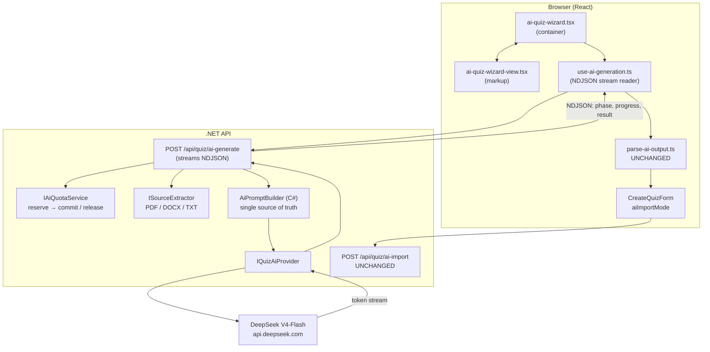

# In-App AI Quiz Generation (Phase 2) — Plan

Status: **planned, not started.** Nothing in this document is implemented yet.
Companion to [`ai-quiz-creation-plan.md`](ai-quiz-creation-plan.md) (Phase 0–1.5, the copy-paste
flow) and [`ai-quiz-architecture.md`](ai-quiz-architecture.md) (how the shipped parts work).
Last updated: 2026-08-09

---

## 1. Goal, and why the current flow doesn't reach it

Phase 1 shipped an AI flow that costs nothing and works: the user configures a quiz, copies a
generated prompt into their own ChatGPT/Claude, and pastes the reply back. It is architecturally
sound and it is not a product. It asks a person to leave the app, use a second account they may
not have, and shuttle text between two tabs — a five-step chore in exchange for a quiz.

Phase 2 collapses that to one button. Two ways in:

- **Topic mode** — the user names a subject ("The French Revolution", "React hooks"), picks a
  language and difficulty, and gets a quiz. No source material at all.
- **Source mode** — the user uploads PDFs / DOCX / TXT (or pastes text) and gets a quiz built
  from that material.

Everything downstream is unchanged. Generation produces the same JSON the copy-paste flow
produces, it flows through the same parser, into the same review builder, and out through the
same atomic `POST /quiz/ai-import`. **Phase 2 replaces one step of the wizard and nothing else.**

Copy-paste stays. It is the free fallback when the provider is down, when a user is out of quota,
and for people who would rather spend their own ChatGPT subscription than our budget.

---

## 2. Decisions locked in

| # | Decision | Rationale |
|---|---|---|
| 1 | **Provider: DeepSeek V4-Flash**, called server-side, behind `IQuizAiProvider` | ~$0.0008 per quiz (§3). OpenAI-compatible wire format, so swapping to Gemini/Claude later is a config change plus one adapter class. |
| 2 | **The API key never reaches the browser** | Non-negotiable. A key in a Vite bundle is a public key. |
| 3 | **Files are extracted server-side and never persisted** | Source material is transient. We keep a hash and a character count, not the document. |
| 4 | **File types v1: PDF, DOCX, TXT, MD** | Covers essentially all study material. No OCR — a scanned PDF gets a clear "no text found" error, not a silent empty quiz. |
| 5 | **Synchronous request with streamed progress** | Generation is 10–40s. A progress stream makes that tolerable without a jobs table, a worker, or resumable state. |
| 6 | **Quota: per-user daily cap, email-verified accounts only** | Signup is cheap; email verification is the throttle we already own. The cap is resolved through a seam so a paid plan later changes a number, not a design. |
| 7 | **The prompt moves to C# and becomes the single source of truth** | Two prompt builders drift. See §5.1. |
| 8 | **Semantic validation stays in `parse-ai-output.ts`** | It is tested, story-covered, and already treats model output as hostile. Duplicating it in C# doubles the surface for zero gain. See §5.2. |
| 9 | **Generated quizzes are always `Draft` and always human-reviewed** | Already true in Phase 1. Topic mode makes it load-bearing (§8). |
| 10 | **A kill switch (`Ai:Enabled`) and a global spend cap ship in the first slice** | The failure we cannot recover from is a surprise bill. |

### Still open

- Whether topic mode should let the model **suggest** a category (§7.3) in v1 or v1.1.
- Batched generation for large question counts (§6.4) — designed here, deferred by default.
- Paid plan mechanics (§9.4) — the quota seam anticipates it; the billing does not exist.

---

## 3. Cost model — the number that justifies the whole design

DeepSeek V4-Flash first-party pricing, August 2026: **$0.14 / 1M input tokens** (cache miss),
**$0.0028 / 1M** (cache hit), **$0.28 / 1M output tokens**. Context window 1M, OpenAI-compatible
ChatCompletions at `https://api.deepseek.com`. New accounts get 5M free tokens.

A representative generation — 8,000 characters of source (~2,500 tokens in, including the ~600
token prompt scaffold) producing 10 questions (~1,500 tokens out):

```
input   2,500 × $0.14/1M  = $0.00035
output  1,500 × $0.28/1M  = $0.00042
                          ─────────
per quiz                  ≈ $0.0008
```

**Roughly a tenth of a cent per quiz.** A thousand generated quizzes a day costs about **$0.80**.
Topic mode is cheaper still (no source material to send).

Two consequences worth stating plainly:

1. **Unit cost is not the risk. Volume is.** The quota and rate-limit layer (§9) matters far more
   than model choice, which is exactly what [`ai-quiz-creation-plan.md` §9](ai-quiz-creation-plan.md)
   predicted.
2. **Cache-hit pricing is 50× cheaper than cache-miss**, which makes the batching design in §6.4
   nearly free: re-sending an identical source prefix across batches hits DeepSeek's automatic
   prefix cache.

> **Verify at implementation time.** Model names changed once already — `deepseek-chat` and
> `deepseek-reasoner` were retired on 2026-07-24 in favour of `deepseek-v4-flash` /
> `deepseek-v4-pro`. Re-check names, prices and the announced peak-hours multiplier against
> [api-docs.deepseek.com](https://api-docs.deepseek.com) before writing the config.

---

## 4. Component map



Solid additions are new. `parse-ai-output.ts`, `CreateQuizForm`, and `ai-import` are untouched —
that is the point of the seam described in
[`ai-quiz-architecture.md` §8](ai-quiz-architecture.md).

### New files and their single responsibilities

| File | Responsibility | Must NOT do |
|---|---|---|
| `Services/Ai/IQuizAiProvider.cs` | Provider-agnostic contract: prompt in, token stream out | Know about quizzes, quotas, or HTTP requests from our clients |
| `Services/Ai/DeepSeekQuizAiProvider.cs` | DeepSeek wire format, retries, token accounting | Build prompts; decide policy |
| `Services/Ai/AiPromptBuilder.cs` | Build the topic-mode and source-mode prompts | Call anything; contain entity IDs |
| `Services/Ai/IAiQuotaService.cs` + impl | Reserve / commit / release a generation slot | Talk to the provider |
| `Services/Ai/SourceExtraction/*` | Bytes → plain text, per file type, with hard caps | Persist files; call the provider |
| `Services/Ai/AiGenerationService.cs` | Orchestrate: quota → extract → prompt → provider → progress events | Hold HTTP or SignalR concerns |
| `Controllers/Quizzes/AiGenerationController.cs` | Multipart intake, auth, rate limit policy, NDJSON response | Business logic |
| `src/.../AI-Quiz/use-ai-generation.ts` | `fetch` + stream reader, exposes phase/progress/result | Render anything |

The container/view split in the wizard is preserved: generation state lives in the container and
the hook, every new visual state is a prop on the view so Storybook can reach it
([`ai-quiz-architecture.md` §9.1](ai-quiz-architecture.md)).

---

## 5. The two things that could rot, and how they don't

### 5.1 Prompt duplication

Today `buildPrompt()` lives in `AI-Quiz/prompt.ts`. Phase 2 needs the same prompt server-side.
Porting it to C# and keeping both is the obvious move and the wrong one: two copies of a
carefully-tuned prompt, edited months apart, silently diverge — and the divergence is invisible
because both "work".

**Decision: C# becomes the single source of truth.** `AiPromptBuilder` owns the prompt text.
Copy-paste mode fetches its prompt from the server:

```
POST /api/quiz/ai-prompt   →  { "prompt": "You are a quiz-generation engine..." }
```

Same request shape as `ai-generate`, minus the file upload; returns the string instead of running
it. `prompt.ts` shrinks to the `AI_QUESTION_LIMITS` constants (which the UI needs for clamping)
and the call. One prompt, exercised by both paths, so a change to it is tested by both.

Cost: copying a prompt now needs a network round trip. That is acceptable — the user is already
authenticated and about to make a much larger request.

### 5.2 Where validation lives

Generation happens on the server; validation should not follow it there. `parse-ai-output.ts` is
~320 lines of hostile-input handling with a story-driven failure catalogue. Reimplementing it in
C# means two validators, two sets of drop-reasons, two bugs.

**Decision: split by concern.**

| Layer | Does | Why there |
|---|---|---|
| Server (`AiGenerationService`) | `extractJson` equivalent + "is it `{questions: [...]}` with ≥1 element" | So it can **retry the model** on garbage without a round trip, and not bill the user's quota for an unusable reply. |
| Browser (`parse-ai-output.ts`) | All semantic validation — per-type rules, difficulty resolution, clamping, drops with reasons | Unchanged code, unchanged stories, unchanged behaviour. A generated reply and a pasted reply are indistinguishable to it. |
| Server (`CreateAiQuizAsync`) | Entity existence, ownership, `Unspecified` refusal, transaction | Already implemented. The real gate. |

The browser is still untrusted — boundary 2 in
[`ai-quiz-architecture.md` §4](ai-quiz-architecture.md) is unaffected, because the import
endpoint re-validates everything regardless of where the JSON came from.

---

## 6. The generation endpoint

### 6.1 Contract

```
POST /api/quiz/ai-generate
Authorization: Bearer <jwt>          [Authorize] + email-verified
Content-Type: multipart/form-data
Rate limit policy: "ai"

Fields:
  mode              "Topic" | "Source"
  topic             string, ≤ 200 chars      (Topic mode)
  sourceText        string, ≤ 20,000 chars   (Source mode, optional alongside files)
  files             0..3 files, ≤ 10 MB each (Source mode)
  languageName      string   — the NAME of the language the user picked
  difficultyNames   string[] — the names that exist in the DB
  questionCount     1..30
  allowedTypes      ("MultipleChoice"|"TrueFalse"|"TypeTheAnswer")[]
  extraInstructions string, ≤ 500 chars, optional

Response: 200, Content-Type: application/x-ndjson
```

No entity IDs cross this boundary in either direction — the same invariant the Phase 1 prompt
holds ([`ai-quiz-creation-plan.md` §5](ai-quiz-creation-plan.md)). Names go out, names come back,
IDs are resolved by code that already exists.

`languageName` is new: with no source material, "write in the same language as the source" is
meaningless, so topic mode must be told the language explicitly. It is a name, not an ID, which
keeps the existing rule intact.

### 6.2 Why NDJSON over a plain JSON response or SSE

`EventSource` is GET-only, so SSE cannot carry a multipart upload. Chunked NDJSON read through
`fetch` + `ReadableStream` costs about forty lines in the hook and works with the existing bearer
auth. Note this is the one place the app cannot use the axios `api` client — worth a comment in
the hook so nobody "fixes" it later.

Event stream:

```jsonc
{"phase":"extracting","detail":"lecture-notes.pdf"}
{"phase":"extracted","chars":18402,"files":2}
{"phase":"generating","questionsReady":0,"questionsTarget":10}
{"phase":"generating","questionsReady":3,"questionsTarget":10}
{"phase":"generating","questionsReady":7,"questionsTarget":10}
{"phase":"done","payload":{"questions":[ ... ]},"usage":{"inputTokens":2511,"outputTokens":1488}}
```

Terminal frame is exactly one of `done` or `error`:

```jsonc
{"phase":"error","code":"QuotaExceeded","message":"You've used all 5 generations for today.","retryAfter":"2026-08-10T00:00:00Z"}
```

**Progress is real, not theatre.** The provider streams token deltas; the service tracks brace
depth in the accumulating JSON and increments `questionsReady` each time a question object closes
at depth 2. "Writing question 7 of 10" is a fact about the stream, not a timer.

Error codes are a closed set the frontend switches on: `QuotaExceeded`, `ProviderUnavailable`,
`ProviderTimeout`, `UnreadableSource`, `SourceTooLarge`, `EmptySource`, `ModelOutputInvalid`,
`FeatureDisabled`.

### 6.3 Orchestration

```
POST /api/quiz/ai-generate
  0. feature flag Ai:Enabled, else FeatureDisabled
  1. quota RESERVE (atomic, see §9.2)          ── on failure: QuotaExceeded, stream closes
  2. extract text from files + sourceText      ── on failure: release reservation
       cap total at Ai:MaxSourceChars
  3. build prompt (AiPromptBuilder)
  4. call provider, stream deltas, emit progress
  5. extract JSON; if unparseable → ONE retry with a stricter reminder
       still unparseable → release reservation, ModelOutputInvalid
  6. quota COMMIT with real token usage
  7. emit {"phase":"done", payload}
```

**A failed generation never consumes quota.** Provider outages, timeouts, and unreadable
documents release the reservation. Only a reply that reached the user's screen is billed to them.

### 6.4 Batching (designed, deferred)

For large `questionCount`, one call asking for 30 questions degrades: later questions get terser
and the output token count risks truncation. The fix is N calls of ~8 questions, each told which
topics the previous batches already covered.

This is cheap specifically because of DeepSeek's prefix cache — the identical source prefix costs
$0.0028/1M on batches 2..N instead of $0.14/1M. It also makes `questionsReady` progress exact
without brace-counting.

**Deferred by default**: it adds de-duplication logic and an ordering concern. Ship single-call,
cap `questionCount` at 15 for generated quizzes (30 remains available for copy-paste, where the
user's own model handles it), and revisit if quality complaints arrive.

---

## 7. Source handling

### 7.1 Extraction

| Type | Library | Notes |
|---|---|---|
| `.txt`, `.md` | none | Encoding-sniff, fall back to UTF-8 |
| `.pdf` | **PdfPig** (`UglyToad.PdfPig`, Apache 2.0) | Page-by-page text; stop at `MaxPages` |
| `.docx` | **DocumentFormat.OpenXml** | Paragraph text; ignore images and headers |

`ISourceExtractor` per type, selected by extension **and** magic bytes — never by the
client-supplied content type.

Hard caps, all configurable, all enforced server-side:

```
Ai:MaxFiles            3
Ai:MaxFileBytes        10 MB      (per file, pre-decompression)
Ai:MaxPdfPages         200
Ai:MaxDocxUncompressed 50 MB      (zip-bomb guard — DOCX is a zip archive)
Ai:MaxSourceChars      40,000     (~10k tokens; truncate with a warning frame, don't fail)
```

A PDF that yields fewer than ~200 characters of text is almost certainly a scan. Return
`UnreadableSource` with a message that says so and suggests pasting the text — silently generating
a quiz from nothing is the worse outcome.

### 7.2 Files are not stored

The existing Files store (`FileRecord`, `docs/media/file-storage.md`) is attach-on-upload with a
known owner and a permanent lifetime. Source material is the opposite: transient, potentially
someone's private study notes, and useless once extracted.

**Nothing is written to disk.** Files are read from the request stream, extracted in memory,
discarded. The usage log records a SHA-256 of the extracted text, the character count, and the
filenames — enough for caching, debugging and audit, with no document retention. Say so in the
UI; "we don't keep your files" is a feature.

### 7.3 Category suggestion (topic mode)

You asked whether topic mode could skip the category. The database cannot — `Quiz.CategoryId` is
required, and `CreateAiQuizAsync` explicitly refuses the seeded `Unspecified` row, because
questions inherit the quiz's category and an unclassifiable question is a bug.

The resolution that gives you the UX without breaking the invariant: **let the model suggest, let
the human confirm.** Pass the list of existing category *names* into the topic-mode prompt, ask
for one back, resolve it by strict case-insensitive match against existing rows — exactly the
difficulty-name mechanism from
[`ai-quiz-creation-plan.md` §2b](ai-quiz-creation-plan.md) — and pre-select it in step 1. No
match, no problem: the field stays empty and the user picks. **Nothing is ever created**, and the
category is still a human's final choice; it just arrives pre-filled.

---

## 8. Topic mode's real risk: hallucination

Source mode has a strong instruction — "base every question strictly on the source material" —
and a human who can check the source. Topic mode has neither. The model is being asked to recall
facts, and the confident-wrong answer is the characteristic failure of every LLM at this task.

This is not solvable by prompting. It is bounded by design:

- **Review is mandatory and already exists.** Generated questions land in the builder, not in a
  published quiz. Nothing reaches a player un-inspected.
- **Status is forced to `Draft`.** Already true; topic mode makes it non-negotiable.
- **Steer toward stable knowledge.** The topic prompt asks for well-established, verifiable facts
  and explicitly forbids questions about recent events, current office-holders, statistics, and
  "most recent X" — the categories where a model's training cutoff produces confidently stale
  answers.
- **Low temperature** (~0.3). Creativity is not what we want here.
- **Tell the user.** A short line in the review step for topic-generated quizzes: *"These were
  written from the model's own knowledge — check the facts before publishing."* Source-generated
  quizzes don't show it.

An honest note for the roadmap: topic mode will produce the occasional wrong answer, and the
mitigation is a human, not a better prompt. If that becomes a support burden, the next step is
grounding — a retrieval pass over a source we control — not a bigger model.

---

## 9. Cost control and abuse

Four independent layers. Any one of them failing does not open the tap.

### 9.1 The layers

| Layer | Mechanism | Catches |
|---|---|---|
| Feature flag | `Ai:Enabled=false` → endpoint 503s, UI falls back to copy-paste | Provider outage, budget emergency |
| Global spend cap | Rolling 30-day token spend vs `Ai:MonthlyTokenBudget`; over budget behaves as disabled | Everything at once |
| Per-user daily quota | `IAiQuotaService`, §9.2 | The steady drip that a rate limiter misses |
| Rate limit + concurrency | New `ai` policy on the existing limiter; **1 in-flight generation per user** | Burst abuse; connection exhaustion from a streaming endpoint |

Email verification is a precondition — `[Authorize]` plus a verified-email check, reusing what
`docs/auth/email-verification.md` already provides. Throwaway accounts get copy-paste.

### 9.2 Quota, and why reserve-then-commit

Counting today's rows and comparing to the cap is a check-then-act race: ten concurrent requests
all read "4 used" and all proceed. Streaming makes the window seconds wide, not milliseconds.

```
RESERVE   INSERT AiGenerationUsage (Status=Reserved) inside a transaction that
          re-counts non-Released rows for (userId, today) and aborts over the cap
COMMIT    Status=Succeeded, write token counts and cost estimate
RELEASE   Status=Released — does not count against the cap
```

Reservations older than 10 minutes are swept to `Released` by a `BackgroundService`, following the
`QuizSessionCleanupService` pattern already in the codebase (a crashed request must not burn a
slot forever).

### 9.3 `AiGenerationUsage` — the one new table

| Column | Type | Notes |
|---|---|---|
| `Id` | `Guid` | PK |
| `UserId` | `Guid` | FK, indexed with `CreatedAt` |
| `Status` | `enum` | `Reserved` / `Succeeded` / `Failed` / `Released` |
| `Mode` | `enum` | `Topic` / `Source` |
| `Topic` | `string?` | topic mode only, for debugging quality complaints |
| `SourceHash` | `string?` | SHA-256 of extracted text — the cache key (§9.5) |
| `SourceChars` | `int` | |
| `QuestionsRequested` / `QuestionsReturned` | `int` | quality signal over time |
| `Model` | `string` | so a provider switch is visible in the data |
| `InputTokens` / `OutputTokens` | `int` | |
| `EstimatedCostUsd` | `decimal(10,6)` | priced at commit; a later price change doesn't rewrite history |
| `ErrorCode` | `string?` | one of the §6.2 codes |
| `CreatedAt` / `CompletedAt` | `DateTime` | |

This table answers every question you will actually ask: what does this feature cost, who uses it,
which mode, and how often does the model disappoint. It is also the natural home for per-plan
counting when §9.4 arrives.

### 9.4 The paid-plan seam

Do not build billing. Build the seam:

```csharp
public interface IAiQuotaPolicy
{
    Task<int> GetDailyLimitAsync(Guid userId);
}
```

v1 implementation returns `Ai:DefaultDailyQuota` (suggest **5**) for verified users, with an
optional per-user override column for people you want to hand more to. A paid plan later is a
second implementation reading a subscription — no caller changes, no schema churn in the usage
table. Roles are the wrong mechanism here: quota is a commercial property, not a permission.

### 9.5 Caching

Key on `SHA256(sourceText + languageName + difficultyNames + questionCount + allowedTypes + extraInstructions)`.
A hit inside 24 hours returns the stored payload, costs nothing, and does not consume quota. This
mostly catches the same user regenerating after a browser refresh — small money, but it makes
double-click idempotent, which is worth it on its own.

### 9.6 Audit

New `AuditActions.AiQuizGenerated` alongside the existing `QuizCreated` entry the import already
writes, so a quiz's provenance is reconstructible from the audit log.

---

## 10. Failure-mode catalogue

| Failure | Behaviour | Quota |
|---|---|---|
| Provider 429 | One retry with backoff, then `ProviderUnavailable` + "try again in a minute" | Released |
| Provider 5xx / network | Same | Released |
| Provider timeout (>90s) | Cancel, `ProviderTimeout` | Released |
| Invalid JSON from model | One stricter retry, then `ModelOutputInvalid` + offer copy-paste | Released |
| Model returns 6 of 10 questions | **Accept.** Tell the user in the review step. | Committed |
| All questions dropped by the parser | Existing Phase 1 error path, unchanged | Committed (the model did reply) |
| Scanned PDF, no text | `UnreadableSource`, name the file | Released |
| Source over char cap | Truncate, emit a warning frame, continue | Committed |
| Prompt injection in an uploaded file | Bounded exactly as today: source is fenced, output is never executed, a human reviews it. Worst case is bad questions. | Committed |
| Quota exhausted | `QuotaExceeded` with reset time; UI surfaces the copy-paste path | n/a |
| Feature flag off / over budget | `FeatureDisabled`; the Generate button is hidden, copy-paste stays | n/a |
| User closes the tab mid-stream | Cancellation token aborts the provider call; sweeper releases the reservation | Released |

---

## 11. Testing

The stage boundaries make almost all of this testable without a network.

- **`AiPromptBuilder`** — golden-file tests for both modes. Assert no entity ID ever appears in
  the output, and that every difficulty/category name came from the supplied list.
- **Extractors** — fixture files per type: normal PDF, scanned PDF (→ `UnreadableSource`),
  200-page PDF (→ page cap), DOCX with images, a zip-bomb DOCX, non-UTF8 TXT.
- **`FakeQuizAiProvider`** — canned streams: good JSON, fenced JSON, prose-wrapped JSON, truncated
  JSON, empty, timeout, 429. The whole orchestration is testable against it.
- **Quota concurrency** — ten parallel reserves against a cap of five commit exactly five. This is
  the test that justifies §9.2 existing at all.
- **Progress accounting** — feed a recorded token stream, assert `questionsReady` increments
  monotonically and ends equal to the question count.
- **Frontend** — the hook against a mocked NDJSON `ReadableStream`; new Storybook stories for
  generating / progress / each error code, per the existing failure-catalogue convention.
- **Unchanged-behaviour guard** — an existing `parse-ai-output` fixture fed through the new path
  must produce a byte-identical `ParseResult`. If it doesn't, the seam leaked.

---

## 12. Phasing

Each slice is independently shippable and independently valuable.

**2.0 — Topic mode, no files, no streaming.** `IQuizAiProvider` + DeepSeek adapter,
`AiPromptBuilder` (both modes; source mode unused for now), `POST /quiz/ai-generate` returning
plain JSON, quota table + reserve/commit, feature flag, spend cap, `ai` rate-limit policy.
Frontend: a "Generate" button in step 2 with a spinner. *Proves the entire pipeline with the
smallest possible surface — no extraction, no stream parsing.*

**2.1 — Prompt consolidation.** `POST /quiz/ai-prompt`; `prompt.ts` becomes a thin client. Ships
after 2.0 so the C# prompt is already proven in production before copy-paste depends on it.

**2.2 — Streaming progress.** Switch the endpoint to NDJSON, add `use-ai-generation.ts`, real
`questionsReady` progress. *Pure UX; the contract's terminal frame carries the same payload 2.0
returned.*

**2.3 — Source mode.** Multipart intake, the three extractors, caps, `UnreadableSource`. The
wizard's paste box gains a dropzone.

**2.4 — Polish.** Category suggestion (§7.3), response caching (§9.5), topic-mode fact-check
notice (§8), usage display ("3 of 5 generations left today").

**2.5+ — Deferred.** Batching (§6.4), paid plans (§9.4), grounding for topic mode.

A reasonable stopping point is 2.3. Everything after that is improvement, not capability.

---

## 13. File change list

**New — backend**

```
Services/Ai/IQuizAiProvider.cs
Services/Ai/DeepSeekQuizAiProvider.cs
Services/Ai/AiPromptBuilder.cs
Services/Ai/AiGenerationService.cs           + IAiGenerationService.cs
Services/Ai/IAiQuotaService.cs               + AiQuotaService.cs
Services/Ai/IAiQuotaPolicy.cs                + ConfigAiQuotaPolicy.cs
Services/Ai/AiReservationSweeper.cs          (BackgroundService)
Services/Ai/SourceExtraction/ISourceExtractor.cs
Services/Ai/SourceExtraction/{PlainText,Pdf,Docx}Extractor.cs
Services/Ai/AiOptions.cs                     (bound from the "Ai" config section)
Models/Ai/AiGenerationUsage.cs
Repositories/AiGenerationUsageRepository.cs  + Interfaces/IAiGenerationUsageRepository.cs
DTOs/Quiz/AiGenerateRequest.cs               + AiGenerateEvent.cs
Controllers/Quizzes/AiGenerationController.cs
Migrations/<stamp>_AddAiGenerationUsage.cs
```

**Modified — backend**

```
Program.cs                       DI, AddHttpClient<DeepSeekQuizAiProvider>, options binding,
                                 hosted sweeper, startup guard (Ai:Enabled with a blank key fails
                                 fast, matching the Authentication provider convention)
Middleware/RateLimitingExtensions.cs   new AiPolicy constant + policy
Services/Audit/AuditActions.cs   AiQuizGenerated
appsettings.json                 "Ai" section, key blank (real key via env / user-secrets)
```

**New — frontend**

```
src/pages/Dashboard/Pages/Quiz/api/generate-ai-quiz.ts     (fetch + NDJSON, not axios)
src/pages/Dashboard/Pages/Quiz/components/AI-Quiz/use-ai-generation.ts
src/pages/Dashboard/Pages/Quiz/components/AI-Quiz/source-dropzone.tsx   (2.3)
```

**Modified — frontend**

```
AI-Quiz/ai-quiz-wizard.tsx        generation state, mode toggle, files
AI-Quiz/ai-quiz-wizard-view.tsx   Generate button, progress, error states, dropzone slot
AI-Quiz/ai-quiz-wizard-view.stories.tsx   new states
AI-Quiz/prompt.ts                 keeps AI_QUESTION_LIMITS; buildPrompt → server call (2.1)
```

**Unchanged, deliberately**

```
AI-Quiz/parse-ai-output.ts
Create-Quiz-Form/*
DTOs/Quiz/AiQuizImportCM.cs
QuizService.CreateAiQuizAsync
POST /api/quiz/ai-import
```

That last block is the measure of whether this plan is right. If implementing Phase 2 forces a
change to the parser or the import transaction, the seam was wrong and it's worth stopping to ask
why.

**Retired**

`microservice/` (Ollama/FastAPI) becomes dead code once 2.0 ships — it was a test, it can't serve
concurrent users, and `docs/README.md` still lists Python and Ollama as optional dependencies.
Delete it in 2.0 and drop those rows from the setup table.

---

## 14. Configuration

```jsonc
"Ai": {
  "Enabled": false,                       // per-environment; blank key + Enabled=true fails startup
  "Provider": "DeepSeek",
  "BaseUrl": "https://api.deepseek.com",
  "Model": "deepseek-v4-flash",
  "ApiKey": "",                           // env: Ai__ApiKey — never in appsettings
  "Temperature": 0.3,
  "TimeoutSeconds": 90,
  "DefaultDailyQuota": 5,
  "MonthlyTokenBudgetUsd": 25,
  "MaxQuestionsPerGeneration": 15,
  "MaxFiles": 3,
  "MaxFileBytes": 10485760,
  "MaxPdfPages": 200,
  "MaxSourceChars": 40000,
  "CacheHours": 24
}
```

---

## 15. Summary of guarantees

After Phase 2, these hold:

1. The provider API key exists only on the server.
2. No AI path can create a category, language, or difficulty — names are resolved against
   existing rows or fall back.
3. No AI-generated quiz reaches a player without a human opening it in the builder.
4. A generation that fails costs the user nothing.
5. Spend has three independent ceilings: per-user daily, global monthly, and a kill switch.
6. Uploaded source documents are never written to disk.
7. Generated and pasted model output travel the same validation path, so neither can regress
   without the other's tests failing.
8. Quiz persistence remains a single transaction — orphan questions stay structurally impossible.

---

## Sources

DeepSeek pricing, model names, JSON mode and limits verified 2026-08-09:

- [DeepSeek API pricing guide (NxCode)](https://www.nxcode.io/resources/news/deepseek-api-pricing-complete-guide-2026)
- [DeepSeek API pricing & cost per token (Morph)](https://www.morphllm.com/deepseek-api)
- [JSON Output — DeepSeek API Docs](https://api-docs.deepseek.com/guides/json_mode/)
- [Rate Limit & Isolation — DeepSeek API Docs](https://api-docs.deepseek.com/quick_start/rate_limit/)
- [DeepSeek V4-Flash context window and limits](https://www.morphllm.com/deepseek-v4-flash)
